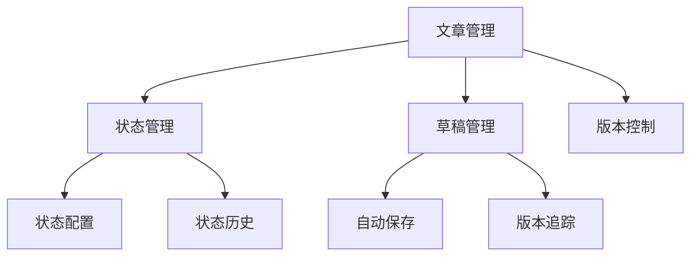

# 开发进度文档

## 最近更新 (2024-03-xx)

### 数据库服务优化

#### 1. 状态获取方法统一化
统一了数据库状态获取方法，解决了不一致调用的问题：

```typescript
// 之前：存在多个不同的状态获取方法
databaseService.getStatus()
databaseService.getDatabaseStatus()

// 现在：统一使用 getDatabaseStatus，并提供兼容方法
async getStatus(): Promise<DatabaseStatus> {
  return this.getDatabaseStatus()
}
```

#### 2. 状态接口增强
扩展了数据库状态接口，提供更详细的信息：

```typescript
interface DatabaseStatus {
  counts: TableCounts
  lastChecked: string
  isHealthy: boolean
  version: string
  tables: Array<{
    name: string
    status: 'ok' | 'error'
    count: number
  }>
}
```

#### 3. 验证路由更新
更新了验证路由以使用统一的状态获取方法：

```typescript
// src/app/api/validate/route.ts
const dbStatus = await databaseService.getDatabaseStatus()
results.database = dbStatus.isHealthy
results.details.database = dbStatus
```

### 代码质量改进

1. **错误处理统一化**
   - 所有数据库操作统一使用 DatabaseError
   - 提供详细的错误信息和状态码
   - 保持错误处理的一致性

2. **类型安全增强**
   - 使用 TypeScript 严格类型定义
   - 完善接口定义
   - 确保类型推断的准确性

3. **向后兼容性**
   - 保持原有 API 调用方式
   - 提供兼容层处理旧的调用方式
   - 确保现有功能不受影响

### 测试计划

#### 1. 基础连接测试
```typescript
// 验证数据库连接
const status = await databaseService.getDatabaseStatus()
console.assert(status.isHealthy, '数据库连接正常')
```

#### 2. 表结构验证
```typescript
// 验证所有必要的表
const { tables } = await databaseService.getDatabaseStatus()
const invalidTables = tables.filter(t => t.status === 'error')
console.assert(invalidTables.length === 0, '所有表结构正常')
```

#### 3. 性能监控
```typescript
// 检查性能指标
const metrics = await databaseService.getPerformanceMetrics()
console.log('响应时间:', metrics.responseTime)
console.log('查询性能:', metrics.queryPerformance)
```

### 下一步计划

1. **性能优化**
   - [ ] 实现查询缓存
   - [ ] 优化批量操作
   - [ ] 添加性能监控指标

2. **功能扩展**
   - [ ] 实现数据迁移功能
   - [ ] 添加数据备份恢复
   - [ ] 完善监控告警

3. **文档完善**
   - [ ] 更新 API 文档
   - [ ] 添加性能优化指南
   - [ ] 完善错误处理文档

## 注意事项

1. 所有数据库操作必须通过服务层进行
2. 保持错误处理的一致性
3. 确保向后兼容性
4. 添加适当的日志记录
5. 定期进行性能测试

## 测试清单

- [ ] 数据库连接测试
- [ ] 表结构验证
- [ ] CRUD 操作测试
- [ ] 性能指标检查
- [ ] 错误处理验证
- [ ] 并发操作测试

## 已完成功能

### 1. 数据库层
- ✅ 基础服务层架构（BaseService）
- ✅ 数据库状态监控（DatabaseService）
  - 连接状态检查
  - 表统计信息
  - 健康检查
  - 关系验证
- ✅ 事务处理和错误处理统一化

参考实现：
```typescript
// src/lib/services/database.ts
startLine: 4
endLine: 24
```

### 2. 博客核心功能
- ✅ 文章管理
  - 列表展示
  - 创建/编辑
  - 状态管理（草稿/发布）
  - 版本控制
- ✅ 标签系统
  - 基础标签管理
  - 文章标签关联

### 3. 测试与调试功能
- ✅ 测试面板
  - 数据库状态实时显示
  - 性能指标监控
  - 测试数据生成

参考实现：
```typescript
// src/components/debug/TestPanel.tsx
startLine: 13
endLine: 45
```

### 4. 前端优化
- ✅ React Query 集成
  - 数据缓存策略
  - 自动重试机制
  - 状态同步
- ✅ 编辑器集成（ReactQuill）
- ✅ 统一的错误处理

---

## 进行中的功能

### 1. 数据库优化
- 🔄 查询性能优化
- 🔄 索引优化
- 🔄 缓存策略完善

### 2. 功能增强
- 🔄 评论系统
- 🔄 用户认证
- 🔄 搜索功能

### 3. 性能优化
- 🔄 SSR/ISR 优化
- 🔄 图片处理优化
- 🔄 首屏加载优化

---

## 开发原则

### 1. 代码复用优先
- 优先使用现有服务层方法
- 复用已有的错误处理机制
- 利用现有的测试框架

### 2. 渐进式开发
- 基于现有稳定功能开发
- 避免破坏性更改
- 保持向后兼容

### 3. 测试驱动开发
- 完善单元测试
- 端到端测试覆盖
- 性能测试基准

---

## 下一步开发计划

### 近期目标（Sprint 1）
1. 评论系统集成
   - 复用现有的数据库服务层
   - 使用相同的错误处理机制
   - 集成到现有的测试框架

2. 搜索功能实现
   - 利用现有的数据库查询优化
   - 复用状态管理逻辑
   - 整合到测试面板

### 中期目标（Sprint 2-3）
1. 用户系统完善
2. 性能优化实施
3. 管理界面增强

### 长期目标
1. 多语言支持
2. API 文档自动生成
3. 监控系统完善

---

## 技术债务管理

### 待优化项
1. 数据库查询性能
2. 前端组件复用
3. 测试覆盖率

### 已解决项
1. 统一错误处理
2. 数据库服务层重构
3. 测试框架搭建

---

## 版本规划

### v0.1.0 (当前版本)
- 基础博客功能
- 数据库管理
- 测试框架

### v0.2.0 (计划中)
- 评论系统
- 搜索功能
- 性能优化

### v1.0.0 (路线图)
- 完整用户系统
- 多语言支持
- 完善的监控

---

## 技术实现详解

### 1. 服务层架构设计

#### 1.1 BaseService（基础服务层）
- 统一的事务处理机制
- 标准化的错误处理流程
- Supabase 客户端实例管理
- 服务层继承体系

#### 1.2 数据库状态监控
- React Query 状态管理集成
- 自定义缓存策略实现
- 实时状态更新机制
- 性能指标收集

### 2. 测试与调试系统

#### 2.1 核心验证功能
- 数据库连接自动验证
- 基础操作完整性测试
- 服务层方法验证
- 错误处理机制测试

#### 2.2 性能监控系统
- API 响应时间追踪
- 渲染性能数据收集
- Markdown 解析性能分析
- 实时性能指标展示

### 3. 数据库管理

#### 3.1 初始化流程
- 数据库清理机制
- 基础数据自动创建
- 验证流程集成
- 错误恢复机制

#### 3.2 查询优化策略
- 索引优化方案
- 批量操作处理
- 缓存策略实现
- 查询性能监控

### 4. React Query 集成规范

#### 4.1 查询配置标准
```typescript
// 标准配置
{
  refetchInterval: false,      // 禁用自动刷新
  refetchOnWindowFocus: false, // 禁用窗口聚焦刷新
  cacheTime: 1000 * 60 * 30,  // 缓存时间：30分钟
  staleTime: Infinity,        // 数据新鲜度控制
  retry: 1                    // 重试次数限制
}
```

#### 4.2 数据刷新策略
- 按需数据刷新
- 手动刷新控制
- 刷新状态反馈
- 相关查询联动

### 5. 安全实践实现

#### 5.1 访问控制
- RLS（Row Level Security）实现
- 最小权限原则应用
- 用户权限验证系统

#### 5.2 数据安全
- Zod 数据验证
- 用户输入安全处理
- SQL 注入防护
- 敏感数据加密

### 6. 开发规范

#### 6.1 代码复用原则
- 优先使用现有服务层
- 遵循错误处理模式
- 复用测试框架
- 维护代码一致性

#### 6.2 性能优化准则
- 应用缓存策略
- 遵循查询优化指南
- 使用性能监控工具
- 定期性能评估

#### 6.3 新功能开发流程
- 基于现有服务扩展
- 保持错误处理一致
- 集成测试框架
- 文档同步更新

---

## 代码示例

### 1. 服务层架构设计

#### 1.1 BaseService（基础服务层）
```typescript
// src/lib/services/base.ts
async transaction<T>(operation: () => Promise<T>, description: string): Promise<T>

// 错误处理流程
protected handleError(error: unknown, context: string): never

// Supabase 客户端实例管理
// src/lib/supabase/client.ts
export const supabase = createClient<Database>(...)
```

#### 1.2 数据库状态监控
```typescript
// src/hooks/useDatabase.ts
export function useDatabaseStatus() {
  return useQuery({
    queryKey: ['database-status'],
    queryFn: () => databaseService.getStatus()
  })
}

// src/lib/services/database.ts
async getPerformanceMetrics(): Promise<DatabaseMetrics>
```

### 2. 测试与调试系统

#### 2.1 核心验证功能
```typescript
// src/scripts/validate-core.ts
async function validateDatabase(): Promise<boolean>

// 基础操作测试
async function validateBasicOperations(): Promise<boolean>
```

#### 2.2 性能监控系统
```typescript
// src/components/debug/TestPanel.tsx
const performanceMetrics = {
  apiResponseTime: listEndTime - listStartTime,
  renderTime: endTime - contentEndTime,
  totalTime: endTime - startTime
}
```

### 3. 数据库管理

#### 3.1 初始化流程
```typescript
// src/lib/services/database.ts
async clearAllData(): Promise<void>

// src/app/api/init-db/route.ts
const tags = await tagService.createMany([...])
```

#### 3.2 查询优化策略
```typescript
// src/lib/services/post.ts
async createMany(posts: CreatePostData[]): Promise<Post[]>

// src/hooks/usePosts.ts
export function usePosts(options: UsePostsOptions = {}) {
  return useQuery({
    queryKey: ['posts', options],
    queryFn: () => postService.getPosts(options),
    staleTime: Infinity,
    cacheTime: 1000 * 60 * 30
  })
}
```

### 4. React Query 集成规范

#### 4.1 标准查询配置
```typescript
// src/hooks/useQueryDefaults.ts
export const defaultQueryConfig = {
  refetchInterval: false,
  refetchOnWindowFocus: false,
  staleTime: Infinity,
  cacheTime: 1000 * 60 * 30,
  retry: 1
}
```

#### 4.2 数据刷新策略
```typescript
// src/hooks/usePostMutations.ts
export function useUpdatePost() {
  const queryClient = useQueryClient()
  return useMutation({
    mutationFn: updatePost,
    onSuccess: () => {
      queryClient.invalidateQueries({ queryKey: ['posts'] })
    }
  })
}
```

### 5. 安全实践实现

#### 5.1 数据验证
```typescript
// src/lib/validations/post.ts
export const postSchema = z.object({
  title: z.string().min(1),
  content: z.string(),
  status: z.enum(['draft', 'published'])
})
```

#### 5.2 错误处理
```typescript
// src/lib/errors/database.ts
export class DatabaseError extends Error {
  constructor(
    message: string,
    public statusCode: number,
    public details?: unknown
  ) {
    super(message)
  }
}
```
# 文章管理系统开发文档

## 系统架构

### 1. 数据层
- PostgreSQL 数据库
- 使用 UUID 作为主键
- JSONB 支持元数据扩展
- 事务保证数据一致性

### 2. 核心模块


### 3. 关键设计决策

#### 状态管理
- 使用配置表管理状态流转
- 记录完整变更历史
- 状态历史可能出现重复记录（设计决策）
  > 使用视图处理重复记录，避免修改现有代码

#### 草稿系统
- 支持多版本管理
- 自动保存机制
- 版本号自增设计

## 开发指南

### 1. 环境设置
```bash
# 数据库初始化
psql -f scripts/init.sql

# 配置初始化
psql -f scripts/init_config.sql
```

### 2. 代码规范

#### SQL 规范
- 使用大写 SQL 关键字
- 使用下划线命名法
- 添加适当的注释
- 使用参数化查询

#### API 规范
- RESTful 设计
- 使用 TypeScript 类型
- 统一错误处理
- 版本控制

### 3. 测试策略

#### 单元测试
```sql
-- 状态变更测试
SELECT test_post_workflow();

-- 草稿管理测试
SELECT test_draft_management();
```

#### 集成测试
```typescript
describe('Article Management', () => {
  it('should handle status changes correctly', async () => {
    // 测试代码
  });
  
  it('should manage drafts properly', async () => {
    // 测试代码
  });
});
```

## 常见问题

### 1. 状态变更问题
- Q: 为什么会有重复的状态历史记录？
- A: 这是由于函数和触发器的双重记录机制导致，通过视图可以解决。

### 2. 性能优化
- 使用适当的索引
- 避免长事务
- 定期清理历史数据

## 维护指南

### 1. 监控指标
```sql
-- 检查状态变更频率
SELECT 
    to_status,
    COUNT(*),
    AVG(EXTRACT(EPOCH FROM (changed_at - lag(changed_at) OVER (PARTITION BY post_id ORDER BY changed_at))))::integer as avg_time_in_status
FROM post_status_history_view
GROUP BY to_status;

-- 检查草稿版本数量
SELECT 
    COUNT(*) as version_count,
    AVG(version_number) as avg_versions
FROM post_draft_versions;
```

### 2. 定期维护
```sql
-- 清理过期的自动保存草稿
DELETE FROM post_draft_versions
WHERE is_auto_save = true
AND created_at < NOW() - INTERVAL '30 days';

-- 优化表
VACUUM ANALYZE post_status_history;
VACUUM ANALYZE post_draft_versions;
```

### 3. 备份策略
- 每日增量备份
- 每周完整备份
- 保留 30 天历史

## 扩展计划

### 1. 待实现功能
- [ ] 状态变更的权限控制
- [ ] 状态变更的钩子（hooks）
- [ ] 状态变更的通知机制
- [ ] 状态变更的审计日志

### 2. 性能优化
- [ ] 添加状态历史分区表
- [ ] 实现草稿版本归档
- [ ] 优化查询性能
``