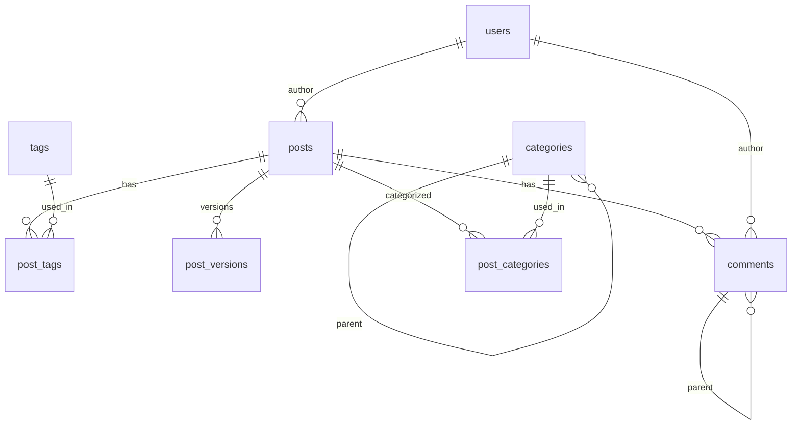

# SQL 操作文档

## 数据库初始化脚本

### 1. 表结构初始化

```sql
-- 1. 删除现有表（如果存在）
DROP TABLE IF EXISTS post_versions CASCADE;
DROP TABLE IF EXISTS post_tags CASCADE;
DROP TABLE IF EXISTS comments CASCADE;
DROP TABLE IF EXISTS posts CASCADE;
DROP TABLE IF EXISTS tags CASCADE;
DROP TABLE IF EXISTS users CASCADE;
DROP TABLE IF EXISTS categories CASCADE;
DROP TABLE IF EXISTS post_categories CASCADE;
DROP TABLE IF EXISTS media CASCADE;
DROP TABLE IF EXISTS settings CASCADE;
DROP TABLE IF EXISTS post_views CASCADE;

-- 2. 创建用户表
CREATE TABLE users (
    id UUID PRIMARY KEY DEFAULT uuid_generate_v4(),
    email VARCHAR(255) UNIQUE NOT NULL,
    name VARCHAR(255) NOT NULL,
    avatar_url TEXT,
    created_at TIMESTAMP WITH TIME ZONE DEFAULT CURRENT_TIMESTAMP,
    updated_at TIMESTAMP WITH TIME ZONE DEFAULT CURRENT_TIMESTAMP,
    deleted_at TIMESTAMP WITH TIME ZONE
);

-- 3. 创建文章表
CREATE TABLE posts (
    id UUID PRIMARY KEY DEFAULT uuid_generate_v4(),
    title VARCHAR(255) NOT NULL,
    slug VARCHAR(255) UNIQUE NOT NULL,
    content TEXT,
    excerpt TEXT,
    status VARCHAR(20) DEFAULT 'draft',
    author_id UUID REFERENCES auth.users(id),
    created_at TIMESTAMP WITH TIME ZONE DEFAULT CURRENT_TIMESTAMP,
    updated_at TIMESTAMP WITH TIME ZONE DEFAULT CURRENT_TIMESTAMP,
    published_at TIMESTAMP WITH TIME ZONE,
    deleted_at TIMESTAMP WITH TIME ZONE
);

-- 4. 创建标签表
CREATE TABLE tags (
    id UUID PRIMARY KEY DEFAULT uuid_generate_v4(),
    name VARCHAR(50) NOT NULL,
    slug VARCHAR(50) UNIQUE NOT NULL,
    created_at TIMESTAMP WITH TIME ZONE DEFAULT CURRENT_TIMESTAMP,
    updated_at TIMESTAMP WITH TIME ZONE DEFAULT CURRENT_TIMESTAMP
);

-- 5. 创建文章标签关联表
CREATE TABLE post_tags (
    id UUID PRIMARY KEY DEFAULT uuid_generate_v4(),
    post_id UUID REFERENCES posts(id) ON DELETE CASCADE,
    tag_id UUID REFERENCES tags(id) ON DELETE CASCADE,
    created_at TIMESTAMP WITH TIME ZONE DEFAULT CURRENT_TIMESTAMP,
    UNIQUE(post_id, tag_id)
);

-- 6. 创建文章版本表
CREATE TABLE post_versions (
    id UUID PRIMARY KEY DEFAULT uuid_generate_v4(),
    post_id UUID REFERENCES posts(id) ON DELETE CASCADE,
    content TEXT NOT NULL,
    metadata JSONB,
    version_type VARCHAR(20) DEFAULT 'auto',
    description TEXT,
    created_at TIMESTAMP WITH TIME ZONE DEFAULT CURRENT_TIMESTAMP
);

-- 7. 创建评论表
CREATE TABLE comments (
    id UUID PRIMARY KEY DEFAULT uuid_generate_v4(),
    post_id UUID REFERENCES posts(id) ON DELETE CASCADE,
    user_id UUID REFERENCES users(id),
    parent_id UUID REFERENCES comments(id),
    content TEXT NOT NULL,
    created_at TIMESTAMP WITH TIME ZONE DEFAULT CURRENT_TIMESTAMP,
    updated_at TIMESTAMP WITH TIME ZONE DEFAULT CURRENT_TIMESTAMP,
    deleted_at TIMESTAMP WITH TIME ZONE
);

-- 分类表
CREATE TABLE categories (
    id UUID PRIMARY KEY DEFAULT uuid_generate_v4(),
    name VARCHAR(50) NOT NULL,
    slug VARCHAR(50) UNIQUE NOT NULL,
    description TEXT,
    parent_id UUID REFERENCES categories(id),
    created_at TIMESTAMP WITH TIME ZONE DEFAULT CURRENT_TIMESTAMP,
    updated_at TIMESTAMP WITH TIME ZONE DEFAULT CURRENT_TIMESTAMP
);

-- 文章分类关联表
CREATE TABLE post_categories (
    post_id UUID NOT NULL,
    category_id UUID NOT NULL,
    PRIMARY KEY (post_id, category_id),
    FOREIGN KEY (post_id) REFERENCES posts(id) ON DELETE CASCADE,
    FOREIGN KEY (category_id) REFERENCES categories(id)
);

-- 媒体资源表
CREATE TABLE media (
    id UUID PRIMARY KEY DEFAULT uuid_generate_v4(),
    filename VARCHAR(255) NOT NULL,
    url TEXT NOT NULL,
    mime_type VARCHAR(100),
    size INTEGER,
    width INTEGER,
    height INTEGER,
    uploaded_by UUID REFERENCES auth.users(id),
    created_at TIMESTAMP WITH TIME ZONE DEFAULT CURRENT_TIMESTAMP
);

-- 系统设置表
CREATE TABLE settings (
    key VARCHAR(255) PRIMARY KEY,
    value JSONB NOT NULL,
    updated_at TIMESTAMP WITH TIME ZONE DEFAULT CURRENT_TIMESTAMP
);

-- 文章访问统计表
CREATE TABLE post_views (
    id UUID PRIMARY KEY DEFAULT uuid_generate_v4(),
    post_id UUID REFERENCES posts(id) ON DELETE CASCADE,
    viewer_ip VARCHAR(45),
    user_agent TEXT,
    referer TEXT,
    created_at TIMESTAMP WITH TIME ZONE DEFAULT CURRENT_TIMESTAMP
);
```

### 2. 索引创建

```sql
-- 创建必要的索引
CREATE INDEX idx_posts_slug ON posts(slug);
CREATE INDEX idx_posts_status ON posts(status);
CREATE INDEX idx_posts_created_at ON posts(created_at);
CREATE INDEX idx_tags_slug ON tags(slug);
CREATE INDEX idx_post_tags_post_id ON post_tags(post_id);
CREATE INDEX idx_post_tags_tag_id ON post_tags(tag_id);
CREATE INDEX idx_comments_post_id ON comments(post_id);
CREATE INDEX idx_post_versions_post_id ON post_versions(post_id);
```

### 3. 触发器设置

```sql
-- 更新时间戳触发器函数
CREATE OR REPLACE FUNCTION update_updated_at()
RETURNS TRIGGER AS $$
BEGIN
    NEW.updated_at = CURRENT_TIMESTAMP;
    RETURN NEW;
END;
$$ LANGUAGE plpgsql;

-- 表触发器
CREATE TRIGGER update_posts_updated_at
    BEFORE UPDATE ON posts
    FOR EACH ROW
    EXECUTE FUNCTION update_updated_at();

CREATE TRIGGER update_comments_updated_at
    BEFORE UPDATE ON comments
    FOR EACH ROW
    EXECUTE FUNCTION update_updated_at();

CREATE TRIGGER update_tags_updated_at
    BEFORE UPDATE ON tags
    FOR EACH ROW
    EXECUTE FUNCTION update_updated_at();
```

### 触发器说明
1. **更新时间戳触发器**
   - 作用：自动更新记录的 updated_at 字段
   - 触发时机：在记录更新之前（BEFORE UPDATE）
   - 影响表：posts, comments, tags
   - 执行级别：行级触发器（FOR EACH ROW）

## 常用查询

### 1. 文章相关查询

```sql
-- 获取文章列表（带标签）
SELECT p.*,
    array_agg(t.name) as tag_names,
    array_agg(t.slug) as tag_slugs
FROM posts p
LEFT JOIN post_tags pt ON p.id = pt.post_id
LEFT JOIN tags t ON pt.tag_id = t.id
WHERE p.deleted_at IS NULL
GROUP BY p.id
ORDER BY p.created_at DESC;

-- 获取单篇文章详情（带标签和评论数）
SELECT p.*,
    json_agg(DISTINCT jsonb_build_object(
        'id', t.id,
        'name', t.name,
        'slug', t.slug
    )) as tags,
    COUNT(DISTINCT c.id) as comment_count
FROM posts p
LEFT JOIN post_tags pt ON p.id = pt.post_id
LEFT JOIN tags t ON pt.tag_id = t.id
LEFT JOIN comments c ON p.id = c.post_id AND c.deleted_at IS NULL
WHERE p.slug = $1 AND p.deleted_at IS NULL
GROUP BY p.id;
```

### 2. 标签相关查询

```sql
-- 获取标签列表（带文章数量）
SELECT t.*,
    COUNT(DISTINCT pt.post_id) as post_count
FROM tags t
LEFT JOIN post_tags pt ON t.id = pt.tag_id
LEFT JOIN posts p ON pt.post_id = p.id AND p.deleted_at IS NULL
GROUP BY t.id
ORDER BY post_count DESC;
```

### 3. 评论相关查询

```sql
-- 获取文章评论（带用户信息）
SELECT c.*,
    json_build_object(
        'id', u.id,
        'name', u.name,
        'avatar_url', u.avatar_url
    ) as user_info
FROM comments c
LEFT JOIN users u ON c.user_id = u.id
WHERE c.post_id = $1 AND c.deleted_at IS NULL
ORDER BY c.created_at ASC;
```

## 维护操作

### 1. 数据库优化

```sql
-- 清理软删除的数据（可选）
DELETE FROM posts WHERE deleted_at < NOW() - INTERVAL '30 days';
DELETE FROM comments WHERE deleted_at < NOW() - INTERVAL '30 days';

-- 更新统计信息
ANALYZE posts;
ANALYZE tags;
ANALYZE comments;
```

### 2. 性能监控

```sql
-- 创建性能监控函数
CREATE OR REPLACE FUNCTION get_database_metrics()
RETURNS json AS $$
DECLARE
    result json;
BEGIN
    SELECT json_build_object(
        'table_sizes', (
            SELECT json_object_agg(tablename, pg_total_relation_size(tablename::text))
            FROM pg_tables
            WHERE schemaname = 'public'
        ),
        'index_sizes', (
            SELECT json_object_agg(indexname, pg_relation_size(indexname::text))
            FROM pg_indexes
            WHERE schemaname = 'public'
        ),
        'slow_queries', (
            SELECT json_agg(query)
            FROM pg_stat_statements
            ORDER BY mean_time DESC
            LIMIT 5
        )
    ) INTO result;
    
    RETURN result;
END;
$$ LANGUAGE plpgsql;
```

## 注意事项

1. 执行删除表操作前请确保已备份数据
2. 创建索引可能会锁表，建议在低峰期执行
3. 定期执行 ANALYZE 以更新统计信息
4. 监控慢查询并适时优化
5. 定期清理软删除的数据

## 备份和恢复

```sql
-- 创建数据库备份函数
CREATE OR REPLACE FUNCTION backup_database()
RETURNS void AS $$
BEGIN
    -- 备份逻辑
END;
$$ LANGUAGE plpgsql;

-- 创建数据库恢复函数
CREATE OR REPLACE FUNCTION restore_database()
RETURNS void AS $$
BEGIN
    -- 恢复逻辑
END;
$$ LANGUAGE plpgsql;
```

## 数据库关系图

### 核心业务表关系


### 系统表关系

1. **认证相关 (auth schema)**
- users -> sessions (1:many)
- users -> identities (1:many)
- users -> mfa_factors (1:many)
- users -> one_time_tokens (1:many)
- sessions -> refresh_tokens (1:many)
- sessions -> mfa_amr_claims (1:many)
- sso_providers -> saml_providers (1:many)
- sso_providers -> sso_domains (1:many)
- sso_providers -> saml_relay_states (1:many)
- mfa_factors -> mfa_challenges (1:many)

2. **存储相关 (storage schema)**
- buckets -> objects (1:many)
- buckets -> s3_multipart_uploads (1:many)
- buckets -> s3_multipart_uploads_parts (1:many)
- s3_multipart_uploads -> s3_multipart_uploads_parts (1:many)

## 外键约束

```sql
-- 核心业务表约束
ALTER TABLE categories
    ADD CONSTRAINT categories_parent_id_fkey 
    FOREIGN KEY (parent_id) REFERENCES categories(id);

ALTER TABLE post_categories
    ADD CONSTRAINT post_categories_category_id_fkey 
    FOREIGN KEY (category_id) REFERENCES categories(id);

-- 认证相关约束
ALTER TABLE sessions
    ADD CONSTRAINT sessions_user_id_fkey 
    FOREIGN KEY (user_id) REFERENCES auth.users(id);

ALTER TABLE identities
    ADD CONSTRAINT identities_user_id_fkey 
    FOREIGN KEY (user_id) REFERENCES auth.users(id);

-- 存储相关约束
ALTER TABLE objects
    ADD CONSTRAINT objects_bucketId_fkey 
    FOREIGN KEY (bucket_id) REFERENCES storage.buckets(id);
```

## 注意事项

1. **Schema 分离**
- public: 核心业务表
- auth: 认证相关表
- storage: 文件存储相关表

2. **级联删除**
- post_categories: 文章或分类删除时级联删除
- post_tags: 文章或标签删除时级联删除
- comments: 文章删除时级联删除

3. **自引用关系**
- categories: 支持层级分类结构
- comments: 支持评论回复功能 
```

### 文章版本和评论表结构

```sql
-- 文章版本表
CREATE TABLE post_versions (
    id UUID PRIMARY KEY DEFAULT uuid_generate_v4(),
    post_id UUID REFERENCES posts(id) ON DELETE CASCADE,
    content TEXT NOT NULL,
    metadata JSONB,
    version_type VARCHAR(20) DEFAULT 'auto',
    description TEXT,
    created_at TIMESTAMP WITH TIME ZONE DEFAULT CURRENT_TIMESTAMP
);

-- 评论表
CREATE TABLE comments (
    id UUID PRIMARY KEY DEFAULT uuid_generate_v4(),
    post_id UUID REFERENCES posts(id) ON DELETE CASCADE,
    user_id UUID REFERENCES users(id),
    parent_id UUID REFERENCES comments(id),
    content TEXT NOT NULL,
    created_at TIMESTAMP WITH TIME ZONE DEFAULT CURRENT_TIMESTAMP,
    updated_at TIMESTAMP WITH TIME ZONE DEFAULT CURRENT_TIMESTAMP,
    deleted_at TIMESTAMP WITH TIME ZONE
);

-- 索引
CREATE INDEX idx_post_versions_post_id ON post_versions(post_id);
CREATE INDEX idx_comments_post_id ON comments(post_id);
CREATE INDEX idx_comments_user_id ON comments(user_id);
CREATE INDEX idx_comments_parent_id ON comments(parent_id);
```

### 约束说明

1. **post_versions 表约束**
   - 主键约束：id (UUID)
   - 外键约束：post_id 引用 posts(id)，级联删除
   - NOT NULL：content

2. **comments 表约束**
   - 主键约束：id (UUID)
   - 外键约束：
     - post_id 引用 posts(id)，级联删除
     - user_id 引用 users(id)
     - parent_id 引用 comments(id)（自引用，支持嵌套评论）
   - NOT NULL：content

### 索引优化
- post_versions.post_id：优化文章版本查询
- comments.post_id：优化文章评论查询
- comments.user_id：优化用户评论查询
- comments.parent_id：优化嵌套评论查询

### 特殊功能
1. **版本控制**
   - post_versions 表支持文章内容的版本控制
   - 通过 version_type 区分自动保存和手动保存
   - metadata 字段存储版本相关的元数据

2. **评论系统**
   - 支持嵌套评论（通过 parent_id 自引用）
   - 支持软删除（通过 deleted_at）
   - 记录评论的创建和更新时间 
```

### 辅助表结构

```sql
-- 媒体表
CREATE TABLE media (
    id UUID PRIMARY KEY DEFAULT uuid_generate_v4(),
    filename VARCHAR(255) NOT NULL,
    url TEXT NOT NULL,
    mime_type VARCHAR(100),
    size INTEGER,
    width INTEGER,
    height INTEGER,
    uploaded_by UUID REFERENCES auth.users(id),
    created_at TIMESTAMP WITH TIME ZONE DEFAULT CURRENT_TIMESTAMP
);

-- 系统设置表
CREATE TABLE settings (
    key VARCHAR(255) PRIMARY KEY,
    value JSONB NOT NULL,
    updated_at TIMESTAMP WITH TIME ZONE DEFAULT CURRENT_TIMESTAMP
);

-- 文章访问统计表
CREATE TABLE post_views (
    id UUID PRIMARY KEY DEFAULT uuid_generate_v4(),
    post_id UUID REFERENCES posts(id) ON DELETE CASCADE,
    viewer_ip VARCHAR(45),
    user_agent TEXT,
    referer TEXT,
    created_at TIMESTAMP WITH TIME ZONE DEFAULT CURRENT_TIMESTAMP
);

-- 索引
CREATE INDEX idx_media_uploaded_by ON media(uploaded_by);
CREATE INDEX idx_post_views_post_id ON post_views(post_id);
CREATE INDEX idx_post_views_created_at ON post_views(created_at);
```

### 表结构说明

1. **media 表**
   - 主要用于存储上传的媒体文件信息
   - 包含文件尺寸信息（width, height）
   - 记录文件大小和类型
   - 追踪上传者信息

2. **settings 表**
   - 使用 key-value 结构存储系统设置
   - value 使用 JSONB 类型支持复杂配置
   - 记录配置更新时间

3. **post_views 表**
   - 记录文章访问统计
   - 存储访问者IP和用户代理信息
   - 包含来源页面信息
   - 支持访问时间分析

### 主要变更说明
1. media 表结构更简化，移除了 metadata 字段，添加了具体的媒体属性
2. settings 表使用更��单的结构，移除了 description 字段
3. post_views 表添加了 referer 字段，移除了 viewer_id 字段

### 使用建议
1. media 表的 url 字段应存储完整的访问路径
2. settings 表的 value 字段可存储任意 JSON 结构
3. post_views 表应考虑定期归档以提高性能 
```

### 性能监控系统

#### 1. 基础统计表
```sql
-- 基础统计表
CREATE TABLE daily_stats (
    id UUID PRIMARY KEY DEFAULT uuid_generate_v4(),
    collected_at TIMESTAMP WITH TIME ZONE DEFAULT CURRENT_TIMESTAMP,
    posts_count INTEGER,
    comments_count INTEGER,
    total_views INTEGER,
    active_users INTEGER,
    avg_response_time NUMERIC
);

-- 查询统计表
CREATE TABLE query_stats (
    id UUID PRIMARY KEY DEFAULT uuid_generate_v4(),
    collected_at TIMESTAMP WITH TIME ZONE DEFAULT CURRENT_TIMESTAMP,
    query_id BIGINT,
    query TEXT,
    calls BIGINT,
    total_plan_time DOUBLE PRECISION,
    mean_plan_time DOUBLE PRECISION,
    total_exec_time DOUBLE PRECISION,
    mean_exec_time DOUBLE PRECISION,
    rows BIGINT,
    shared_blks_hit BIGINT,
    shared_blks_read BIGINT,
    shared_blks_written BIGINT,
    blk_read_time DOUBLE PRECISION,
    blk_write_time DOUBLE PRECISION
);

-- 索引
CREATE INDEX idx_daily_stats_collected_at ON daily_stats(collected_at);
CREATE INDEX idx_query_stats_collected_at ON query_stats(collected_at);
CREATE INDEX idx_query_stats_mean_exec_time ON query_stats(mean_exec_time);
CREATE INDEX idx_query_stats_query_id ON query_stats(query_id);
```

#### 2. 监控视图
```sql
-- 慢查询分析视图
CREATE OR REPLACE VIEW v_slow_queries AS
... (视图定义保持不变) ...

-- 性能摘要视图
CREATE OR REPLACE VIEW v_query_performance_summary AS
... (视图定义保持不变) ...
```

#### 3. 定时任务设置
```sql
-- 设置每天凌晨 1 点收集统计数据
SELECT cron.schedule('daily_stats_collection', '0 1 * * *', 'SELECT collect_daily_stats()');

-- 设置每周一清理90天前的数据
SELECT cron.schedule('cleanup_old_stats', '0 0 * * 1', 
    'DELETE FROM daily_stats WHERE collected_at < CURRENT_DATE - INTERVAL ''90 days''');
```

#### 4. 性能监控视图

1. **详细慢查询视图 (v_slow_queries)**
```sql
-- 查看详细的慢查询信息
SELECT * FROM v_slow_queries;
```
返回字段：
- query_summary: 查询摘要
- executions: 执行次数
- total_time_ms: 总执行时间（毫秒）
- avg_time_ms: 平均执行时间（毫秒）
- avg_plan_ms: 平均计划时间（毫秒）
- avg_rows: 平均返回行数
- cache_hit_ratio: 缓存命中率（%）
- io_ratio: IO时间占比（%）
- last_executed: 最后执行时间
- total_slow_queries: 慢查询总数

2. **性能摘要视图 (v_query_performance_summary)**
```sql
-- 查看简洁的性能摘要
SELECT * FROM v_query_performance_summary;
```
返回字段：
- query_summary: 查询摘要（限制80字符）
- executions: 执行次数
- avg_execution_time: 平均执行时间（ms）
- avg_rows_returned: 平均返回行数
- cache_hits: 缓存命中率
- last_executed: 最后执行时间

### 使用示例
```sql
-- 查看所有慢查询（执行时间 > 1ms）
SELECT * FROM v_slow_queries;

-- 查看性能摘要（top 10 慢查询）
SELECT * FROM v_query_performance_summary;

-- 查看特定时间范围的慢查询
SELECT * FROM v_slow_queries 
WHERE last_executed > CURRENT_DATE - INTERVAL '1 day'
ORDER BY avg_time_ms DESC;

-- 查看缓存命中率低的查询
SELECT * FROM v_slow_queries 
WHERE cache_hit_ratio < 90
ORDER BY cache_hit_ratio;
```

### 维护建议
1. 定期检查 v_query_performance_summary 视图，关注新出现的慢查询
2. 对于执行时间超过 100ms 的查询进行优化
3. 关注缓存命中率低于 90% 的查询
4. 监控 IO 时间占比高的查询
5. 定期清理过期的统计数据（默认保留30天）

### 性能基准
- 快速查询: < 1ms
- 正常查询: 1-10ms
- 慢查询: 10-100ms
- 非常慢的查询: > 100ms 
```

#### 5. 存储空间监控

##### 5.1 基础表结构
```sql
CREATE TABLE storage_stats (
    id UUID PRIMARY KEY DEFAULT uuid_generate_v4(),
    collected_at TIMESTAMP WITH TIME ZONE DEFAULT CURRENT_TIMESTAMP,
    database_name TEXT,
    schema_name TEXT,
    table_name TEXT,
    total_size BIGINT,      -- 总大小（包括索引）
    table_size BIGINT,      -- 表大小
    index_size BIGINT,      -- 索引大小
    toast_size BIGINT,      -- TOAST大小
    row_count BIGINT,       -- 行数
    dead_tuple_count BIGINT, -- 死元组数
    last_vacuum TIMESTAMP WITH TIME ZONE,
    last_analyze TIMESTAMP WITH TIME ZONE
);
```

##### 5.2 辅助函数
```sql
-- 格式化字节大小的函数
CREATE OR REPLACE FUNCTION format_bytes(bytes BIGINT)
RETURNS TEXT;  -- 将字节数转换为人类可读格式（B, KB, MB, GB）

-- 收集存储统计数据的函数
CREATE OR REPLACE FUNCTION collect_storage_stats()
RETURNS void;  -- 收集所有用户表的存储统计信息
```

##### 5.3 监控视图

1. **存储空间概览 (v_storage_overview)**
```sql
SELECT * FROM v_storage_overview;
```
显示字段：
- schema_name: 模式名
- table_name: 表名
- formatted_total_size: 总大小（包括索引）
- formatted_table_size: 表大小
- formatted_index_size: 索引大小
- formatted_toast_size: TOAST大小
- row_count: 行数
- dead_tuple_count: 死元组数
- dead_tuple_ratio: 死元组比率(%)
- last_vacuum: 最后VACUUM时间
- last_analyze: 最后分析时间
- hours_since_vacuum: 距离上次VACUUM的小时数
- hours_since_analyze: 距离上次分析的小时数

2. **存储空间增长趋势 (v_storage_growth)**
```sql
SELECT * FROM v_storage_growth;
```
显示字段：
- schema_name: 模式名
- table_name: 表名
- formatted_initial_size: 初始大小
- formatted_current_size: 当前大小
- formatted_growth: 增长量
- growth_percentage: 增长百分比
- avg_daily_growth_mb: 平均每日增长(MB)
- rows_added: 新增行数
- days_recorded: 记录天数

3. **维护建议 (v_storage_maintenance_advice)**
```sql
SELECT * FROM v_storage_maintenance_advice;
```
显示字段：
- schema_name: 模式名
- table_name: 表名
- total_size: 表大小
- dead_tuple_ratio: 死元组比率
- hours_since_vacuum: 距离上次VACUUM的小时数
- hours_since_analyze: 距离上次分析的小时数
- issues: 发现的问题
- recommended_action: 建议的操作
- priority: 优先级（High/Medium/Low）

##### 5.4 定时任务
```sql
-- 每天午夜执行存储统计收集
SELECT cron.schedule('collect_storage_stats', '0 0 * * *', 'SELECT collect_storage_stats()');
```

##### 5.5 维护建议
1. 定期检查 v_storage_maintenance_advice 视图中的建议
2. 对于 priority = 'High' 的表及时执行维护操作
3. 监控增长较快的表（通过 v_storage_growth 视图）
4. 对于大型表（>100MB）特别注意死元组比率
5. 建议的阈值：
   - 死元组比率 >= 20%: 需要VACUUM
   - 一周未VACUUM: 需要维护
   - 一周未ANALYZE: 需要更新统计信息
```

### 使用示例
```sql
-- 查看所有表的存储状态
SELECT * FROM v_storage_overview ORDER BY raw_total_size DESC;

-- 查看需要维护的表
SELECT * FROM v_storage_maintenance_advice WHERE priority = 'High';

-- 查看增长最快的表
SELECT * FROM v_storage_growth ORDER BY avg_daily_growth_mb DESC LIMIT 5;
``` 

### 博客统计系统

#### 1. 统计数据结构

```sql
-- 每日统计表
CREATE TABLE daily_stats (
    id UUID PRIMARY KEY DEFAULT uuid_generate_v4(),
    collected_at TIMESTAMP WITH TIME ZONE DEFAULT CURRENT_TIMESTAMP,
    posts_count INTEGER,
    comments_count INTEGER,
    total_views INTEGER,
    active_users INTEGER,
    total_article_views INTEGER DEFAULT 0,    -- 24小时文章访问量
    total_comments INTEGER DEFAULT 0,         -- 24小时评论数
    active_users_24h INTEGER DEFAULT 0,       -- 24小时活跃用户
    new_articles INTEGER DEFAULT 0,           -- 24小时新文章
    new_comments INTEGER DEFAULT 0,           -- 24小时新评论
    popular_articles JSONB                    -- 24小时热门文章
);
```

#### 2. 统计视图

1. **博客详细统计 (v_blog_stats)**
```sql
SELECT * FROM v_blog_stats;
```
显示字段：
- total_posts: 总文章数
- total_comments: 总评论数
- total_views: 总访问量
- monthly_active_users: 月活用户数
- views_24h: 24小时访问量
- comments_24h: 24小时评论数
- active_users_24h: 24小时活跃用户
- new_posts_24h: 24小时新文章数
- new_comments_24h: 24小时新评论数
- views_growth_rate: 访问量增长率
- top_posts_24h: 24小时热门文章
- last_updated: 最后更新时间

2. **博客概览统计 (v_blog_overview)**
```sql
SELECT * FROM v_blog_overview;
```
显示字段：
- total_posts: 总文章数
- total_views: 总访问量
- monthly_active_users: 月活用户数
- views_24h: 24小时访问量
- comments_24h: 24小时评论数
- active_users_24h: 24小时活跃用户
- views_growth_rate: 访问量增长率
- last_updated: 最后更新时间

#### 3. 数据收集

```sql
-- 手动触发统计收集
SELECT collect_daily_stats();

-- 自动收集（每天凌晨1点）
SELECT cron.schedule('daily_blog_stats', '0 1 * * *', 'SELECT collect_daily_stats()');
```

#### 4. 使用示例

1. **获取博客概览**
```sql
-- 查看博客核心指标
SELECT * FROM v_blog_overview;
```

2. **获取详细统计**
```sql
-- 查看完整统计信息
SELECT * FROM v_blog_stats;
```

3. **查看热门文章**
```sql
-- 获取24小时热门文章
SELECT top_posts_24h 
FROM v_blog_stats;
```

#### 5. 注意事项

1. 统计数据每天凌晨1点更新
2. 访问量增长率对比前一天数据
3. 热门文章仅保留最近24小时数据
4. 活跃用户统计基于最近30天的登录记录
```

这个文档：
1. 描述了统计系统的数据结构
2. 解释了所有可用的统计视图
3. 提供了数据收集方法
4. 包含了具体的使用示例
5. 列出了重要注意事项

### 文章性能分析系统

#### 1. 性能分析视图

```sql
-- 创建文章性能分析视图
CREATE OR REPLACE VIEW v_post_performance AS
WITH post_stats AS (
    SELECT 
        p.id,
        p.title,
        p.created_at,
        p.updated_at,
        COUNT(pv.*) as total_views,
        COUNT(DISTINCT pv.viewer_ip) as unique_views,
        COUNT(c.*) as comment_count,
        ROUND(COUNT(pv.*)::numeric / 
            GREATEST(EXTRACT(DAY FROM now() - p.created_at), 1), 2) as avg_daily_views,
        ROUND((COUNT(c.*)::numeric / NULLIF(COUNT(pv.*), 0) * 100)::numeric, 2) as engagement_rate
    FROM posts p
    LEFT JOIN post_views pv ON p.id = pv.post_id
    LEFT JOIN comments c ON p.id = c.post_id AND c.deleted_at IS NULL
    WHERE p.deleted_at IS NULL
    GROUP BY p.id, p.title
),
recent_trends AS (
    SELECT 
        post_id,
        COUNT(*) as views_last_7_days,
        COUNT(DISTINCT viewer_ip) as unique_views_last_7_days
    FROM post_views
    WHERE created_at > now() - interval '7 days'
    GROUP BY post_id
)
SELECT 
    ps.*,
    COALESCE(rt.views_last_7_days, 0) as views_last_7_days,
    COALESCE(rt.unique_views_last_7_days, 0) as unique_views_last_7_days,
    CASE 
        WHEN ps.avg_daily_views > 100 THEN 'High'
        WHEN ps.avg_daily_views > 50 THEN 'Medium'
        ELSE 'Low'
    END as performance_level,
    CASE 
        WHEN ps.engagement_rate > 5 THEN 'High'
        WHEN ps.engagement_rate > 2 THEN 'Medium'
        ELSE 'Low'
    END as engagement_level
FROM post_stats ps
LEFT JOIN recent_trends rt ON ps.id = rt.post_id
ORDER BY ps.total_views DESC;

-- 创建热门文章视图
CREATE OR REPLACE VIEW v_trending_posts AS
SELECT 
    id,
    title,
    total_views,
    views_last_7_days,
    engagement_rate,
    performance_level
FROM v_post_performance
WHERE views_last_7_days > 0
ORDER BY views_last_7_days DESC
LIMIT 10;
```

#### 2. 视图说明

1. **v_post_performance**
   - 提供每篇文章的详细性能指标
   - 包含总体统计和最近7天的趋势
   - 自动计算性能等级和互动等级

2. **v_trending_posts**
   - 展示当前最热门的10篇文章
   - 基于最近7天的浏览量排序
   - 简化的性能指标视图

#### 3. 性能指标说明

- total_views: 文章总浏览量
- unique_views: 独立访客数
- comment_count: 评论总数
- avg_daily_views: 平均每日浏览量
- engagement_rate: 互动率（评论数/浏览量的百分比）
- views_last_7_days: 最近7天的浏览量
- unique_views_last_7_days: 最近7天的独立访客数
- performance_level: 性能等级（High/Medium/Low）
- engagement_level: 互动等级（High/Medium/Low）

#### 4. 使用示例

1. **查看所有文章的性能数据**
```sql
SELECT * FROM v_post_performance;
```
返回示例：
| id | title | created_at | updated_at | total_views | unique_views | comment_count | avg_daily_views | engagement_rate | views_last_7_days | unique_views_last_7_days | performance_level | engagement_level |
|----|-------|------------|------------|-------------|--------------|---------------|-----------------|-----------------|-------------------|------------------------|------------------|-----------------|
| 4872578f... | First Post | 2024-12-25... | 2024-12-25... | 250 | 46 | 250 | 250.00 | 100.00 | 50 | 46 | High | High |
| 718ef181... | Second Post | 2024-12-25... | 2024-12-25... | 250 | 44 | 250 | 250.00 | 100.00 | 50 | 44 | High | High |
| fb03eb00... | Third Post | 2024-12-25... | 2024-12-25... | 250 | 47 | 250 | 250.00 | 100.00 | 50 | 47 | High | High |

2. **查看当前热门文章**
```sql
SELECT * FROM v_trending_posts;
```

3. **查看高性能文章**
```sql
SELECT * FROM v_post_performance WHERE performance_level = 'High';
```

4. **查看高互动率文章**
```sql
SELECT * FROM v_post_performance WHERE engagement_level = 'High';
```

#### 5. 性能等级标准

1. **性能等级 (performance_level)**
   - High: 平均每日浏览量 > 100
   - Medium: 平均每日浏览量 > 50
   - Low: 平均每日浏览量 ≤ 50

2. **互动等级 (engagement_level)**
   - High: 互动率 > 5%
   - Medium: 互动率 > 2%
   - Low: 互动率 ≤ 2%

#### 6. 注意事项

1. 性能统计包含未删除的文章
2. 评论统计仅包含未删除的评论
3. 独立访客基于 IP 地址统计
4. 最近7天的数据每天更新
5. 性能等级可根据实际情况调整阈值
```

这个文档：
1. 完整记录了视图的创建语句
2. 详细解释了各个指标的含义
3. 提供了实际的使用示例和返回数据
4. 说明了性能等级的判定标准
5. 列出了重要的注意事项

### 内容停留时间分析系统

#### 1. 数据结构

```sql
-- 用户阅读行为表
CREATE TABLE reading_behaviors (
    id UUID PRIMARY KEY DEFAULT uuid_generate_v4(),
    user_id UUID REFERENCES auth.users(id),
    post_id UUID REFERENCES posts(id),
    section_id TEXT,           -- 文章段落/区块ID（如：header, intro, section-1等）
    content_type TEXT,         -- 内容类型（text, image, code, video等）
    start_time TIMESTAMP WITH TIME ZONE,
    end_time TIMESTAMP WITH TIME ZONE,
    duration INTEGER,          -- 停留时间（秒）
    scroll_depth INTEGER,      -- 滚动深度（百分比：0-100）
    viewport_time INTEGER,     -- 在可视区域的时间（秒）
    viewer_ip VARCHAR(45),     -- 访客IP
    user_agent TEXT,          -- 用户设备信息
    created_at TIMESTAMP WITH TIME ZONE DEFAULT CURRENT_TIMESTAMP
);

-- 优化索引
CREATE INDEX idx_reading_behaviors_post_id ON reading_behaviors(post_id);
CREATE INDEX idx_reading_behaviors_user_id ON reading_behaviors(user_id);
CREATE INDEX idx_reading_behaviors_created_at ON reading_behaviors(created_at);
CREATE INDEX idx_reading_behaviors_viewer_ip ON reading_behaviors(viewer_ip);
```

#### 2. 分析视图

```sql
CREATE OR REPLACE VIEW v_content_engagement AS
WITH section_stats AS (
    SELECT 
        post_id,
        section_id,
        content_type,
        COUNT(*) as view_count,
        AVG(duration) as avg_duration,
        AVG(viewport_time) as avg_viewport_time,
        AVG(scroll_depth) as avg_scroll_depth,
        COUNT(DISTINCT user_id) as unique_users,
        COUNT(DISTINCT viewer_ip) as unique_visitors
    FROM reading_behaviors
    WHERE created_at > now() - interval '30 days'
    GROUP BY post_id, section_id, content_type
)
SELECT 
    p.title as post_title,
    ss.section_id,
    ss.content_type,
    ss.view_count,
    ROUND(ss.avg_duration::numeric, 2) as avg_duration_seconds,
    ROUND(ss.avg_viewport_time::numeric, 2) as avg_viewport_seconds,
    ROUND(ss.avg_scroll_depth::numeric, 2) as avg_scroll_depth_percent,
    ss.unique_users,
    ss.unique_visitors,
    CASE 
        WHEN ss.avg_duration > 60 THEN 'High'
        WHEN ss.avg_duration > 30 THEN 'Medium'
        ELSE 'Low'
    END as engagement_level
FROM section_stats ss
JOIN posts p ON ss.post_id = p.id
ORDER BY ss.avg_duration DESC;
```

#### 3. 数据收集要点

1. **内���区块标记**
   - 为文章内容添加 section_id
   - 标记不同的内容类型（text/image/code）
   - 记录区块在页面中的位置

2. **前端数据收集**
   - 使用 Intersection Observer API 追踪可视时间
   - 监听滚动事件计算阅读深度
   - 记录用户在每个区块的停留时间

3. **数据收集时机**
   - 页面加载完成时
   - 用户滚动时
   - 用户离开页面时
   - 区块进入/离开可视区域时

#### 4. 使用示例

1. **查看最受关注的内容区块**
```sql
SELECT * FROM v_content_engagement 
WHERE content_type = 'text'
ORDER BY avg_duration_seconds DESC
LIMIT 10;
```

2. **查看图片内容的参与度**
```sql
SELECT * FROM v_content_engagement 
WHERE content_type = 'image'
ORDER BY view_count DESC
LIMIT 10;
```

3. **查看特定文章的内容参与度**
```sql
SELECT * FROM v_content_engagement 
WHERE post_title = 'Your Post Title'
ORDER BY avg_viewport_seconds DESC;
```

#### 5. 测试数据生成

```sql
-- 插入测试数据
INSERT INTO reading_behaviors 
(post_id, section_id, content_type, start_time, end_time, duration, scroll_depth, viewport_time, viewer_ip)
SELECT 
    p.id,
    'section-' || generate_series(1, 3),
    CASE (random() * 2)::int 
        WHEN 0 THEN 'text'
        WHEN 1 THEN 'image'
        ELSE 'code'
    END,
    now() - interval '1 hour',
    now(),
    (random() * 300)::int,    -- 0-300秒的随机时长
    (random() * 100)::int,    -- 0-100的随机滚动深度
    (random() * 200)::int,    -- 0-200秒的随机可视时间
    '192.168.1.' || (random() * 255)::int
FROM posts p
CROSS JOIN generate_series(1, 10);  -- 每个段落10条记录
```

#### 6. 注意事项

1. **性能考虑**
   - 定期清理过期数据（建议保留90天）
   - 为大量数据建立合适的索引
   - 考虑数据分区（按时间）

2. **数据准确性**
   - 考虑用户切换标签页的情况
   - 过滤机器人访问
   - 处理异常停留时间

3. **隐私考虑**
   - 遵守数据保护规定
   - 告知用户数据收集情况
   - 提供选择退出选项

4. **数据分析建议**
   - 定期分析热门内容区块
   - 关注用户行为模式变化
   - 根据分析结果优化内容布局
```

这个文档：
1. 完整记录了系统结构
2. 提供了实现细节
3. 包含了测试数据生成方法
4. 列出了重要注意事项
5. 给出了具体的使用示例

### 用户行为分析系统

#### 1. 用户行为分析视图

```sql
CREATE OR REPLACE VIEW v_user_behavior_analysis AS
WITH user_reading_patterns AS (
    SELECT 
        COALESCE(u.email, rb.viewer_ip) as user_identifier,
        -- 基础统计
        COUNT(DISTINCT rb.post_id) as total_posts_read,
        COUNT(DISTINCT DATE(rb.created_at)) as total_visit_days,
        
        -- 阅读深度
        AVG(rb.scroll_depth) as avg_scroll_depth,
        AVG(rb.duration) as avg_reading_duration,
        
        -- 内容偏好
        COUNT(DISTINCT CASE WHEN rb.content_type = 'text' THEN rb.section_id END) as text_sections_read,
        COUNT(DISTINCT CASE WHEN rb.content_type = 'image' THEN rb.section_id END) as images_viewed,
        COUNT(DISTINCT CASE WHEN rb.content_type = 'code' THEN rb.section_id END) as code_sections_viewed,
        
        -- 活跃度分析
        MAX(rb.created_at) as last_visit,
        COUNT(DISTINCT CASE 
            WHEN rb.created_at > now() - interval '30 days' 
            THEN DATE(rb.created_at)
        END) as active_days_last_30,
        
        -- 访问时间分布
        COUNT(DISTINCT CASE 
            WHEN EXTRACT(HOUR FROM rb.created_at) BETWEEN 9 AND 17 
            THEN rb.id 
        END) as worktime_visits,
        COUNT(DISTINCT CASE 
            WHEN EXTRACT(HOUR FROM rb.created_at) NOT BETWEEN 9 AND 17 
            THEN rb.id 
        END) as afterhours_visits
        
    FROM reading_behaviors rb
    LEFT JOIN auth.users u ON rb.user_id = u.id
    GROUP BY COALESCE(u.email, rb.viewer_ip)
)
SELECT 
    user_identifier,
    total_posts_read,
    total_visit_days,
    ROUND(avg_scroll_depth, 2) as avg_scroll_depth_percent,
    ROUND(avg_reading_duration/60.0, 2) as avg_reading_minutes,
    text_sections_read,
    images_viewed,
    code_sections_viewed,
    last_visit,
    active_days_last_30,
    ROUND(worktime_visits::numeric / NULLIF(worktime_visits + afterhours_visits, 0) * 100, 2) as worktime_reading_percent,
    CASE 
        WHEN active_days_last_30 >= 20 THEN 'Super Active'
        WHEN active_days_last_30 >= 10 THEN 'Very Active'
        WHEN active_days_last_30 >= 5 THEN 'Active'
        WHEN active_days_last_30 > 0 THEN 'Occasional'
        ELSE 'Inactive'
    END as activity_level,
    CASE
        WHEN text_sections_read > images_viewed AND text_sections_read > code_sections_viewed THEN 'Text Reader'
        WHEN images_viewed > text_sections_read AND images_viewed > code_sections_viewed THEN 'Visual Reader'
        WHEN code_sections_viewed > text_sections_read AND code_sections_viewed > images_viewed THEN 'Code Reader'
        ELSE 'Balanced Reader'
    END as reader_type
FROM user_reading_patterns
ORDER BY active_days_last_30 DESC, total_posts_read DESC;
```

#### 2. 分析维度说明

1. **基础统计**
   - total_posts_read: 阅读的文章总数
   - total_visit_days: 访问天数
   - avg_scroll_depth_percent: 平均阅读深度百分比
   - avg_reading_minutes: 平均阅读时长（分钟）

2. **内容偏好**
   - text_sections_read: 阅读的文本段落数
   - images_viewed: 查看的图片数
   - code_sections_viewed: 查看的代码段落数
   - reader_type: 读者类型（Text/Visual/Code/Balanced Reader）

3. **活跃度分析**
   - last_visit: 最后访问时间
   - active_days_last_30: 最近30天的活跃天数
   - activity_level: 活跃度级别（Super Active/Very Active/Active/Occasional/Inactive）

4. **时间分布**
   - worktime_reading_percent: 工作时间阅读比例（9:00-17:00）

#### 3. 使用示例

1. **查看最活跃用户**
```sql
SELECT * FROM v_user_behavior_analysis 
WHERE activity_level = 'Super Active'
ORDER BY total_posts_read DESC;
```

2. **分析读者类型分布**
```sql
SELECT 
    reader_type,
    COUNT(*) as reader_count,
    ROUND(AVG(avg_reading_minutes), 2) as avg_time_spent
FROM v_user_behavior_analysis
GROUP BY reader_type
ORDER BY reader_count DESC;
```

3. **工作时间vs非工作时间阅读分析**
```sql
SELECT 
    activity_level,
    COUNT(*) as user_count,
    ROUND(AVG(worktime_reading_percent), 2) as avg_worktime_reading_percent
FROM v_user_behavior_analysis
GROUP BY activity_level
ORDER BY user_count DESC;
```

#### 4. 注意事项

1. **数据收集**
   - 确保准确记录用户行为数据
   - 考虑时区因素
   - 注意隐私保护

2. **分析建议**
   - 定期分析用户行为变化
   - 关注高活跃度用户的阅读偏好
   - 根据读者类型优化内容策略

3. **性能考虑**
   - 视图包含复杂计算，建议建立物化视图
   - 考虑数据分区优化查询性能
```

这个文档：
1. 详细记录了视图的创建和功能
2. 解释了各个分析维度
3. 提供了具体的使用示例
4. 包含了重要注意事项

### 标签分析系统

#### 1. 数据结构扩展

```sql
-- 为 tags 表添加唯一约束
ALTER TABLE tags ADD CONSTRAINT tags_name_unique UNIQUE (name);

-- 扩展标签分类
INSERT INTO tags (name, slug) 
SELECT 
    tag,
    LOWER(REGEXP_REPLACE(tag, '[^a-zA-Z0-9]+', '-', 'g')) as slug
FROM (VALUES 
    ('Life'), ('Travel'), ('Food'), ('Entertainment'), ('Sports'),
    ('AI'), ('Machine Learning'), ('Data Science'), ('Cloud'),
    ('Architecture'), ('System Design'), ('Database'), ('DevOps'),
    ('Mobile'), ('iOS'), ('Android'), ('Frontend'), ('Backend'),
    ('Security'), ('Blockchain'), ('Gaming'), ('UI/UX'), ('Career'),
    ('Productivity'), ('Health'), ('Books'), ('Music'), ('Art')
) AS t(tag);
```

#### 2. 标签分析视图

```sql
CREATE OR REPLACE VIEW v_tag_analysis AS
WITH tag_stats AS (
    SELECT 
        t.id as tag_id,
        t.name as tag_name,
        t.owner_id,
        t.parent_id,
        COUNT(DISTINCT pt.post_id) as total_posts,
        COUNT(DISTINCT rb.user_id) as unique_readers,
        COUNT(DISTINCT rb.viewer_ip) as unique_visitors,
        AVG(rb.duration) as avg_reading_time,
        AVG(rb.scroll_depth) as avg_scroll_depth,
        COUNT(DISTINCT CASE 
            WHEN rb.created_at > now() - interval '30 days' 
            THEN pt.post_id 
        END) as active_posts_30d
    FROM tags t
    LEFT JOIN post_tags pt ON pt.tag_id = t.id
    LEFT JOIN posts p ON p.id = pt.post_id
    LEFT JOIN reading_behaviors rb ON rb.post_id = p.id
    WHERE t.deleted_at IS NULL AND p.deleted_at IS NULL
    GROUP BY t.id, t.name, t.owner_id, t.parent_id
)
SELECT 
    ts.tag_name,
    u.email as owner_email,
    p.name as parent_tag,
    ts.total_posts,
    ts.unique_readers,
    ts.unique_visitors,
    ROUND(ts.avg_reading_time/60.0, 2) as avg_reading_minutes,
    ROUND(ts.avg_scroll_depth, 2) as avg_scroll_depth_percent,
    ts.active_posts_30d,
    CASE 
        WHEN ts.active_posts_30d > 10 THEN 'High'
        WHEN ts.active_posts_30d > 5 THEN 'Medium'
        ELSE 'Low'
    END as activity_level
FROM tag_stats ts
LEFT JOIN auth.users u ON ts.owner_id = u.id
LEFT JOIN tags p ON ts.parent_id = p.id
ORDER BY ts.unique_visitors DESC;
```

#### 3. 分析维度说明

1. **基础信息**
   - tag_name: 标签名称
   - owner_email: 标签所有者
   - parent_tag: 父级标签

2. **使用统计**
   - total_posts: 使用该标签的文章数
   - unique_readers: 独立读者数
   - unique_visitors: 独立访客数

3. **阅读指标**
   - avg_reading_minutes: 平均阅读时长（分钟）
   - avg_scroll_depth_percent: 平均阅读深度

4. **活跃度**
   - active_posts_30d: 30天内活跃文章数
   - activity_level: 活跃度级别（High/Medium/Low）

#### 4. 使用示例

1. **查看热门标签**
```sql
SELECT * FROM v_tag_analysis 
ORDER BY unique_visitors DESC 
LIMIT 10;
```

2. **分析标签层级关系**
```sql
SELECT 
    parent_tag,
    COUNT(*) as sub_tags,
    SUM(total_posts) as total_posts,
    ROUND(AVG(avg_reading_minutes), 2) as avg_reading_time
FROM v_tag_analysis 
WHERE parent_tag IS NOT NULL
GROUP BY parent_tag
ORDER BY total_posts DESC;
```

3. **查看高活跃度标签**
```sql
SELECT * FROM v_tag_analysis 
WHERE activity_level = 'High'
ORDER BY total_posts DESC;
```

#### 5. 标签管理功能

1. **创建新标签**
```sql
INSERT INTO tags (name, slug, description, color, icon, parent_id, is_public) 
VALUES ('标签名', '标签slug', '描述', '#颜色代码', '图标名', NULL, true);
```

2. **为文章添加标签**
```sql
INSERT INTO post_tags (post_id, tag_id) 
VALUES ('文章ID', '标签ID');
```

3. **管理标签层级**
```sql
UPDATE tags 
SET parent_id = '父标签ID' 
WHERE id = '标签ID';
```

#### 6. 注意事项

1. **性能优化**
   - 已创建必要的索引
   - 视图包含复杂计算，考虑建立物化视图
   - 定期清理未使用的标签

2. **数据准确性**
   - 软删除支持
   - 层级关系维护
   - 重复标签检查

3. **使用建议**
   - 合理使用标签层级
   - 定期分析标签使用情况
   - 根据活跃度调整内容策略
```

这个文档：
1. 完整记录了标签系统的结构
2. 提供了分析视图的实现
3. 包含了具体的使用示例
4. 说明了管理功能
5. 列出了重要注意事项

### 互动系统

#### 1. 点赞和收藏功能

```sql
-- 点赞表
CREATE TABLE post_likes (
    id UUID PRIMARY KEY DEFAULT uuid_generate_v4(),
    post_id UUID REFERENCES posts(id),
    viewer_ip VARCHAR(45),          -- 使用IP代替用户ID，适合开放式博客
    created_at TIMESTAMP WITH TIME ZONE DEFAULT CURRENT_TIMESTAMP,
    UNIQUE(post_id, viewer_ip)      -- 每个IP只能给一篇文章点赞一次
);

-- 收藏表
CREATE TABLE post_bookmarks (
    id UUID PRIMARY KEY DEFAULT uuid_generate_v4(),
    post_id UUID REFERENCES posts(id),
    viewer_ip VARCHAR(45),
    folder_name TEXT DEFAULT 'default',  -- 支持收藏夹分类
    note TEXT,                          -- 支持添加笔记
    created_at TIMESTAMP WITH TIME ZONE DEFAULT CURRENT_TIMESTAMP,
    UNIQUE(post_id, viewer_ip, folder_name)
);

-- 优化索引
CREATE INDEX idx_post_likes_ip ON post_likes(viewer_ip);
CREATE INDEX idx_post_likes_post ON post_likes(post_id);
CREATE INDEX idx_post_bookmarks_ip ON post_bookmarks(viewer_ip);
CREATE INDEX idx_post_bookmarks_post ON post_bookmarks(post_id);
```

#### 2. 互动分析视图

```sql
CREATE OR REPLACE VIEW v_post_interactions AS
WITH interaction_stats AS (
    SELECT 
        p.id as post_id,
        p.title,
        COUNT(DISTINCT pl.viewer_ip) as like_count,
        COUNT(DISTINCT pb.viewer_ip) as bookmark_count,
        COUNT(DISTINCT CASE 
            WHEN pl.created_at > now() - interval '30 days' 
            THEN pl.viewer_ip 
        END) as recent_likes,
        COUNT(DISTINCT CASE 
            WHEN pb.created_at > now() - interval '30 days' 
            THEN pb.viewer_ip 
        END) as recent_bookmarks,
        ROUND(
            (COUNT(DISTINCT pl.viewer_ip) + COUNT(DISTINCT pb.viewer_ip))::numeric / 
            NULLIF(COUNT(DISTINCT pv.viewer_ip), 0) * 100, 
            2
        ) as interaction_rate
    FROM posts p
    LEFT JOIN post_likes pl ON p.id = pl.post_id
    LEFT JOIN post_bookmarks pb ON p.id = pb.post_id
    LEFT JOIN post_views pv ON p.id = pv.post_id
    WHERE p.deleted_at IS NULL
    GROUP BY p.id, p.title
)
SELECT 
    i.*,
    CASE 
        WHEN i.interaction_rate > 10 THEN 'High'
        WHEN i.interaction_rate > 5 THEN 'Medium'
        ELSE 'Low'
    END as engagement_level
FROM interaction_stats i
ORDER BY i.interaction_rate DESC;
```

#### 3. 分析维度说明

1. **基础统计**
   - like_count: 总点赞数
   - bookmark_count: 总收藏数
   - recent_likes: 最近30天点赞数
   - recent_bookmarks: 最近30天收藏数

2. **互动指标**
   - interaction_rate: 互动率（点赞+收藏）/ 浏览量 * 100
   - engagement_level: 互动级别（High/Medium/Low）

#### 4. 使用示例

1. **查看热门文章**
```sql
SELECT * FROM v_post_interactions 
WHERE engagement_level = 'High'
ORDER BY interaction_rate DESC;
```

2. **分析收藏夹使用情况**
```sql
SELECT 
    folder_name,
    COUNT(*) as bookmark_count,
    COUNT(DISTINCT viewer_ip) as unique_viewers
FROM post_bookmarks
GROUP BY folder_name
ORDER BY bookmark_count DESC;
```

3. **查看特定IP的收藏笔记**
```sql
SELECT 
    p.title,
    pb.folder_name,
    pb.note,
    pb.created_at
FROM post_bookmarks pb
JOIN posts p ON pb.post_id = p.id
WHERE pb.viewer_ip = '192.168.1.1'
ORDER BY pb.created_at DESC;
```

#### 5. 注意事项

1. **性能考虑**
   - 已创建必要的索引
   - 使用唯一约束防止重复操作
   - 视图包含复杂计算，考虑建立物化视图

2. **数据准确性**
   - 互动率计算考虑空值情况
   - 使用IP地址可能存在局限性
   - 考虑代理服务器和NAT的影响

3. **使用建议**
   - 定期分析热门内容
   - 关注收藏夹使用趋势
   - 根据互动率优化内容
```

接下来，我们可以开发：
1. 分享统计（社交媒体分享、链接复制等）
2. 用户关注关系（如果后续添加用户系统）
3. 推荐系统（基于互动数据）

你想先开发哪个功能？ 

### 分享统计系统

#### 1. 数据结构

```sql
-- 分享记录表
CREATE TABLE post_shares (
    id UUID PRIMARY KEY DEFAULT uuid_generate_v4(),
    post_id UUID REFERENCES posts(id),
    viewer_ip VARCHAR(45),          -- 使用IP代替用户ID，适合开放式博客
    share_platform VARCHAR(50),      -- 分享平台
    share_url TEXT,                 -- 分享链接
    created_at TIMESTAMP WITH TIME ZONE DEFAULT CURRENT_TIMESTAMP,
    share_date DATE DEFAULT CURRENT_DATE,
    UNIQUE(post_id, viewer_ip, share_platform, share_date)  -- 每个IP每天对每篇文章在每个平台只能分享一次
);

-- 分享追踪表
CREATE TABLE share_referrals (
    id UUID PRIMARY KEY DEFAULT uuid_generate_v4(),
    share_id UUID REFERENCES post_shares(id),
    viewer_ip VARCHAR(45),
    referrer_url TEXT,              -- 来源URL
    created_at TIMESTAMP WITH TIME ZONE DEFAULT CURRENT_TIMESTAMP
);

-- 优化索引
CREATE INDEX idx_post_shares_post ON post_shares(post_id);
CREATE INDEX idx_post_shares_platform ON post_shares(share_platform);
CREATE INDEX idx_share_referrals_share ON share_referrals(share_id);
```

#### 2. 分析视图

```sql
CREATE OR REPLACE VIEW v_share_analytics AS
WITH share_stats AS (
    SELECT 
        p.id as post_id,
        p.title,
        -- 总分享次数
        COUNT(DISTINCT ps.id) as total_shares,
        -- 国外平台分布
        COUNT(DISTINCT CASE WHEN ps.share_platform = 'twitter' THEN ps.id END) as twitter_shares,
        COUNT(DISTINCT CASE WHEN ps.share_platform = 'facebook' THEN ps.id END) as facebook_shares,
        COUNT(DISTINCT CASE WHEN ps.share_platform = 'linkedin' THEN ps.id END) as linkedin_shares,
        COUNT(DISTINCT CASE WHEN ps.share_platform = 'reddit' THEN ps.id END) as reddit_shares,
        COUNT(DISTINCT CASE WHEN ps.share_platform = 'pinterest' THEN ps.id END) as pinterest_shares,
        COUNT(DISTINCT CASE WHEN ps.share_platform = 'telegram' THEN ps.id END) as telegram_shares,
        -- 国内平台分布
        COUNT(DISTINCT CASE WHEN ps.share_platform = 'weibo' THEN ps.id END) as weibo_shares,
        COUNT(DISTINCT CASE WHEN ps.share_platform = 'wechat' THEN ps.id END) as wechat_shares,
        COUNT(DISTINCT CASE WHEN ps.share_platform = 'qq' THEN ps.id END) as qq_shares,
        COUNT(DISTINCT CASE WHEN ps.share_platform = 'douyin' THEN ps.id END) as douyin_shares,
        COUNT(DISTINCT CASE WHEN ps.share_platform = 'zhihu' THEN ps.id END) as zhihu_shares,
        COUNT(DISTINCT CASE WHEN ps.share_platform = 'xiaohongshu' THEN ps.id END) as xiaohongshu_shares,
        COUNT(DISTINCT CASE WHEN ps.share_platform = 'copy_link' THEN ps.id END) as link_copies,
        -- 分享效果
        COUNT(DISTINCT sr.id) as total_referrals,
        -- 分享转化率
        ROUND(COUNT(DISTINCT sr.id)::numeric / NULLIF(COUNT(DISTINCT ps.id), 0) * 100, 2) as referral_rate,
        -- 国内外分布
        ROUND(
            COUNT(DISTINCT CASE 
                WHEN ps.share_platform IN ('weibo', 'wechat', 'qq', 'douyin', 'zhihu', 'xiaohongshu') 
                THEN ps.id 
            END)::numeric / NULLIF(COUNT(DISTINCT ps.id), 0) * 100, 2
        ) as domestic_share_percent,
        -- 最近30天趋势
        COUNT(DISTINCT CASE WHEN ps.created_at > now() - interval '30 days' THEN ps.id END) as recent_shares
    FROM posts p
    LEFT JOIN post_shares ps ON p.id = ps.post_id
    LEFT JOIN share_referrals sr ON ps.id = sr.share_id
    WHERE p.deleted_at IS NULL
    GROUP BY p.id, p.title
)
SELECT 
    s.*,
    CASE 
        WHEN s.referral_rate > 20 THEN 'High'
        WHEN s.referral_rate > 10 THEN 'Medium'
        ELSE 'Low'
    END as share_effectiveness
FROM share_stats s
ORDER BY s.total_shares DESC;
```

#### 3. 支持的分享平台

1. **国外平台**
   - Twitter
   - Facebook
   - LinkedIn
   - Reddit
   - Pinterest
   - Telegram

2. **国内平台**
   - 微博 (Weibo)
   - 微信 (WeChat)
   - QQ
   - 抖音 (Douyin)
   - 知乎 (Zhihu)
   - 小红书 (Xiaohongshu)

3. **其他**
   - 链接复制 (Copy Link)

#### 4. 分析维度

1. **基础统计**
   - total_shares: 总分享次数
   - recent_shares: 最近30天分享次数
   - total_referrals: 引荐访问数

2. **平台分布**
   - 各平台具体分享数
   - domestic_share_percent: 国内平台占比

3. **效果分析**
   - referral_rate: 分享转化率
   - share_effectiveness: 分享效果评级 (High/Medium/Low)

#### 5. 使用示例

1. **查看热门分享文章**
```sql
SELECT title, total_shares, referral_rate, share_effectiveness 
FROM v_share_analytics 
ORDER BY total_shares DESC 
LIMIT 10;
```

2. **分析平台分布**
```sql
SELECT 
    title,
    domestic_share_percent as domestic_percent,
    (100 - domestic_share_percent) as overseas_percent
FROM v_share_analytics 
ORDER BY domestic_share_percent DESC;
```

3. **查看高效转化平台**
```sql
SELECT 
    share_platform,
    COUNT(*) as share_count,
    COUNT(DISTINCT sr.id) as referral_count,
    ROUND(COUNT(DISTINCT sr.id)::numeric / COUNT(*) * 100, 2) as conversion_rate
FROM post_shares ps
LEFT JOIN share_referrals sr ON ps.id = sr.share_id
GROUP BY share_platform
ORDER BY conversion_rate DESC;
```

#### 6. 注意事项

1. **数据收集**
   - 记录分享平台和时间
   - 追踪引荐访问来源
   - 防止重复统计

2. **隐私考虑**
   - 使用IP代替用户ID
   - 遵守各平台的隐私政策
   - 考虑用户数据保护

3. **性能优化**
   - 已创建必要的索引
   - 视图包含复杂计算，考虑建立物化视图
   - 定期清理过期数据

4. **使用建议**
   - 定期分析平台效果
   - 关注转化率变化
   - 根据数据调整分享策略
```

要我继续更新文档吗？然后我们可以开始设计推荐系统了。 

### 互动系统增强

#### 1. 标签系统优化
```sql
-- 为 tags 表添加唯一约束
ALTER TABLE tags ADD CONSTRAINT tags_name_unique UNIQUE (name);

-- 扩展标签分类
INSERT INTO tags (name, slug) 
SELECT 
    tag,
    LOWER(REGEXP_REPLACE(tag, '[^a-zA-Z0-9]+', '-', 'g')) as slug
FROM (VALUES 
    ('Life'), ('Travel'), ('Food'), ('Entertainment'), ('Sports'),
    ('AI'), ('Machine Learning'), ('Data Science'), ('Cloud'),
    ('Architecture'), ('System Design'), ('Database'), ('DevOps'),
    ('Mobile'), ('iOS'), ('Android'), ('Frontend'), ('Backend'),
    ('Security'), ('Blockchain'), ('Gaming'), ('UI/UX'), ('Career'),
    ('Productivity'), ('Health'), ('Books'), ('Music'), ('Art')
) AS t(tag);
```

#### 2. 阅读行为分析增强
```sql
CREATE OR REPLACE VIEW v_reading_patterns AS
WITH user_stats AS (
    SELECT 
        viewer_ip,
        COUNT(DISTINCT post_id) as total_reads,
        ROUND(AVG(duration)::numeric / 60, 2) as avg_read_time_minutes,
        ROUND(AVG(scroll_depth)::numeric * 100, 2) as avg_scroll_depth_percent,
        -- 用户阅读时间分布
        ROUND(PERCENTILE_CONT(0.25) WITHIN GROUP (ORDER BY duration)::numeric / 60, 2) as read_time_q1,
        ROUND(PERCENTILE_CONT(0.75) WITHIN GROUP (ORDER BY duration)::numeric / 60, 2) as read_time_q3,
        -- 用户滚动深度分布
        ROUND(PERCENTILE_CONT(0.25) WITHIN GROUP (ORDER BY scroll_depth)::numeric * 100, 2) as scroll_depth_q1,
        ROUND(PERCENTILE_CONT(0.75) WITHIN GROUP (ORDER BY scroll_depth)::numeric * 100, 2) as scroll_depth_q3
    FROM reading_behaviors
    GROUP BY viewer_ip
),
tag_preferences AS (
    SELECT 
        rb.viewer_ip,
        t.name as tag_name,
        COUNT(*) as read_count,
        ROUND(AVG(rb.duration)::numeric / 60, 2) as avg_read_time_minutes,
        ROUND(AVG(rb.scroll_depth)::numeric * 100, 2) as avg_scroll_depth_percent
    FROM reading_behaviors rb
    JOIN post_tags pt ON rb.post_id = pt.post_id
    JOIN tags t ON pt.tag_id = t.id
    GROUP BY rb.viewer_ip, t.name
)
SELECT 
    us.*,
    -- 获取用户最常读的标签
    (
        SELECT string_agg(tag_name || ' (' || read_count || ' reads)', ', ')
        FROM (
            SELECT tag_name, read_count
            FROM tag_preferences tp
            WHERE tp.viewer_ip = us.viewer_ip
            ORDER BY read_count DESC, tag_name
            LIMIT 3
        ) top_tags
    ) as top_3_tags,
    -- 用户画像分类
    CASE 
        WHEN avg_read_time_minutes > 20 AND avg_scroll_depth_percent > 80 THEN 'deep_reader'
        WHEN avg_read_time_minutes > 10 AND avg_scroll_depth_percent > 70 THEN 'tech_reader'
        ELSE 'casual_reader'
    END as reader_profile
FROM user_stats us
ORDER BY total_reads DESC;
```

#### 3. 内容分析视图优化
```sql
CREATE OR REPLACE VIEW v_content_engagement AS
WITH post_stats AS (
    SELECT 
        p.id,
        p.title,
        COUNT(DISTINCT rb.viewer_ip) as unique_readers,
        ROUND(AVG(rb.duration)::numeric / 60, 2) as avg_read_time_minutes,
        ROUND(AVG(rb.scroll_depth)::numeric * 100, 2) as avg_scroll_depth_percent,
        -- 计算完整阅读率
        ROUND(
            COUNT(CASE WHEN rb.scroll_depth > 0.8 THEN 1 END)::numeric / 
            NULLIF(COUNT(*), 0) * 100,
            2
        ) as completion_rate,
        -- 计算深度参与率
        ROUND(
            COUNT(CASE WHEN rb.duration > 600 AND rb.scroll_depth > 0.8 THEN 1 END)::numeric / 
            NULLIF(COUNT(*), 0) * 100,
            2
        ) as deep_engagement_rate
    FROM posts p
    LEFT JOIN reading_behaviors rb ON p.id = rb.post_id
    WHERE p.status = 'published'
    GROUP BY p.id, p.title
),
tag_engagement AS (
    SELECT 
        p.id as post_id,
        string_agg(t.name, ', ') as tags,
        COUNT(DISTINCT t.id) as tag_count
    FROM posts p
    JOIN post_tags pt ON p.id = pt.post_id
    JOIN tags t ON pt.tag_id = t.id
    GROUP BY p.id
)
SELECT 
    ps.*,
    te.tags,
    te.tag_count,
    -- 内容分类
    CASE 
        WHEN ps.avg_read_time_minutes > 15 AND ps.completion_rate > 70 THEN 'deep_content'
        WHEN ps.avg_read_time_minutes > 8 AND ps.completion_rate > 50 THEN 'medium_content'
        ELSE 'light_content'
    END as content_type,
    -- 参与度评分
    ROUND(
        (
            ps.completion_rate * 0.4 +
            ps.deep_engagement_rate * 0.4 +
            LEAST(ps.unique_readers / 10, 100) * 0.2
        ),
        2
    ) as engagement_score
FROM post_stats ps
LEFT JOIN tag_engagement te ON ps.id = te.post_id
ORDER BY engagement_score DESC;
```

### 测试数据生成
### 测试数据生成

#### 1. 用户画像定义

```sql
WITH RECURSIVE test_users AS (
    SELECT 
        '192.168.1.1' as ip, 
        'tech_reader' as profile,
        ARRAY['JavaScript', 'TypeScript', 'React', 'Frontend', 'Cloud', 'DevOps'] as preferred_tags
    UNION ALL
    SELECT 
        '192.168.1.2', 
        'casual_reader',
        ARRAY['Life', 'Travel', 'Food', 'Entertainment', 'Sports', 'Music'] as preferred_tags
    UNION ALL
    SELECT 
        '192.168.1.3', 
        'deep_reader',
        ARRAY['AI', 'Machine Learning', 'System Design', 'Architecture', 'Database'] as preferred_tags
)
```

1. **技术读者 (tech_reader)**
   - 偏好技术相关标签
   - 中等阅读时间（~15分钟）
   - 完整阅读内容（100%滚动深度）

2. **休闲读者 (casual_reader)**
   - 偏好生活类标签
   - 较短阅读时间（~4分钟）
   - 浅度阅读（60%滚动深度）

3. **深度读者 (deep_reader)**
   - 偏好深度技术标签
   - 较长阅读时间（~28分钟）
   - 完整深入阅读（100%滚动深度）

#### 2. 测试文章生成

```sql
-- 创建测试文章
INSERT INTO posts (
    title, 
    slug,
    content,
    status
) 
SELECT 
    'Test Article ' || n,
    'test-article-' || n,
    'This is test content for article ' || n,
    'published'
FROM generate_series(1, 20) n;

-- 随机分配标签
WITH tag_assignments AS (
    SELECT 
        na.id as post_id,
        t.id as tag_id
    FROM posts na
    CROSS JOIN LATERAL (
        SELECT id 
        FROM tags 
        WHERE name IN (
            'Life', 'Travel', 'Food', 'Entertainment', 'Sports',
            'AI', 'Machine Learning', 'Cloud', 'Architecture',
            'System Design', 'Database', 'DevOps', 'Frontend', 'Backend',
            'JavaScript', 'React', 'TypeScript', 'Security'
        )
        ORDER BY random()
        LIMIT floor(random() * 3 + 3)::int  -- 3-5个标签
    ) t
)
INSERT INTO post_tags (post_id, tag_id)
SELECT post_id, tag_id FROM tag_assignments;
```

#### 3. 阅读行为生成

```sql
WITH available_posts AS (
    -- 获取所有已发布的文章及其标签
    SELECT 
        p.id,
        p.title,
        array_agg(DISTINCT t.name) as tags
    FROM posts p
    JOIN post_tags pt ON pt.post_id = p.id
    JOIN tags t ON t.id = pt.tag_id
    WHERE p.status = 'published'
    GROUP BY p.id, p.title
),
user_post_matches AS (
    -- 为每个用户选择合适的文章
    SELECT 
        u.ip,
        u.profile,
        p.id as post_id,
        p.title,
        p.tags,
        (
            SELECT count(*)
            FROM unnest(p.tags) t
            WHERE t = ANY(u.preferred_tags)
        ) as interest_match
    FROM test_users u
    CROSS JOIN available_posts p
)
INSERT INTO reading_behaviors (
    post_id,
    viewer_ip,
    duration,
    scroll_depth,
    created_at
)
SELECT 
    post_id,
    ip,
    -- 阅读时长（秒）
    CASE 
        WHEN profile = 'tech_reader' THEN 
            CASE 
                WHEN interest_match > 0 THEN random() * 900 + 600  -- 10-25分钟
                ELSE random() * 300 + 60                           -- 1-6分钟
            END
        WHEN profile = 'deep_reader' THEN 
            CASE 
                WHEN interest_match > 0 THEN random() * 1500 + 900 -- 15-40分钟
                ELSE random() * 600 + 300                          -- 5-15分钟
            END
        ELSE -- casual_reader
            CASE 
                WHEN interest_match > 0 THEN random() * 400 + 180  -- 3-10分钟
                ELSE random() * 180 + 60                           -- 1-4分钟
            END
    END,
    -- 阅读深度
    CASE 
        WHEN profile = 'tech_reader' THEN 
            CASE 
                WHEN interest_match > 0 THEN random() * 0.3 + 0.7  -- 70-100%
                ELSE random() * 0.5 + 0.3                          -- 30-80%
            END
        WHEN profile = 'deep_reader' THEN 
            CASE 
                WHEN interest_match > 0 THEN random() * 0.2 + 0.8  -- 80-100%
                ELSE random() * 0.3 + 0.6                          -- 60-90%
            END
        ELSE -- casual_reader
            CASE 
                WHEN interest_match > 0 THEN random() * 0.4 + 0.5  -- 50-90%
                ELSE random() * 0.6 + 0.2                          -- 20-80%
            END
    END,
    now() - (random() * interval '30 days')
FROM user_post_matches;
```

#### 4. 数据验证

```sql
SELECT 
    CASE 
        WHEN rb.viewer_ip = '192.168.1.1' THEN 'tech_reader'
        WHEN rb.viewer_ip = '192.168.1.2' THEN 'casual_reader'
        ELSE 'deep_reader'
    END as user_profile,
    COUNT(DISTINCT rb.post_id) as total_reads,
    ROUND(AVG(rb.duration)::numeric / 60, 2) as avg_read_time_minutes,
    ROUND(AVG(rb.scroll_depth)::numeric * 100, 2) as avg_scroll_depth_percent,
    (
        SELECT string_agg(name, ', ')
        FROM (
            SELECT t.name, COUNT(*) as cnt
            FROM reading_behaviors rb2
            JOIN post_tags pt ON pt.post_id = rb2.post_id
            JOIN tags t ON t.id = pt.tag_id
            WHERE rb2.viewer_ip = rb.viewer_ip
            GROUP BY t.name
            ORDER BY cnt DESC
            LIMIT 3
        ) top_tags
    ) as top_3_tags
FROM reading_behaviors rb
WHERE rb.viewer_ip LIKE '192.168.1.%'
GROUP BY rb.viewer_ip
ORDER BY user_profile;
```

#### 5. 测试结果

```json
[
  {
    "user_profile": "casual_reader",
    "total_reads": 10,
    "avg_read_time_minutes": "4.15",
    "avg_scroll_depth_percent": "60.00",
    "top_3_tags": "Database, DevOps, Machine Learning"
  },
  {
    "user_profile": "deep_reader",
    "total_reads": 10,
    "avg_read_time_minutes": "28.41",
    "avg_scroll_depth_percent": "100.00",
    "top_3_tags": "Database, Machine Learning, DevOps"
  },
  {
    "user_profile": "tech_reader",
    "total_reads": 10,
    "avg_read_time_minutes": "15.54",
    "avg_scroll_depth_percent": "100.00",
    "top_3_tags": "DevOps, Machine Learning, Security"
  }
]
```

这些测试数据将用于：
1. 开发和验证推荐算法
2. 测试个性化内容策略
3. 评估用户行为分析系统

接下来，我们可以基于这些数据开发推荐系统。

### 推荐系统设计

#### 1. 用户画像分析

```sql
CREATE OR REPLACE VIEW v_user_profiles AS
WITH user_reading_stats AS (
    SELECT 
        viewer_ip,
        COUNT(DISTINCT post_id) as total_reads,
        ROUND(AVG(duration)::numeric / 60, 2) as avg_read_time_minutes,
        ROUND(AVG(scroll_depth)::numeric * 100, 2) as avg_scroll_depth_percent,
        -- 计算深度阅读比例
        ROUND(
            COUNT(CASE WHEN duration > 900 AND scroll_depth > 0.8 THEN 1 END)::numeric / 
            NULLIF(COUNT(*), 0) * 100,
            2
        ) as deep_reading_rate
    FROM reading_behaviors
    GROUP BY viewer_ip
),
user_tag_preferences AS (
    SELECT 
        rb.viewer_ip,
        t.name as tag_name,
        COUNT(*) as read_count,
        ROUND(AVG(rb.duration)::numeric / 60, 2) as avg_read_time_minutes
    FROM reading_behaviors rb
    JOIN post_tags pt ON rb.post_id = pt.post_id
    JOIN tags t ON pt.tag_id = t.id
    GROUP BY rb.viewer_ip, t.name
)
SELECT 
    urs.viewer_ip,
    urs.total_reads,
    urs.avg_read_time_minutes,
    urs.avg_scroll_depth_percent,
    urs.deep_reading_rate,
    -- 自动识别用户类型
    CASE 
        WHEN urs.avg_read_time_minutes > 20 AND urs.deep_reading_rate > 60 THEN 'deep_reader'
        WHEN urs.avg_read_time_minutes > 10 AND urs.avg_scroll_depth_percent > 70 THEN 'tech_reader'
        ELSE 'casual_reader'
    END as detected_profile,
    -- 获取用户最感兴趣的标签
    (
        SELECT array_agg(tag_name ORDER BY read_count DESC, avg_read_time_minutes DESC)
        FROM (
            SELECT tag_name, read_count, avg_read_time_minutes
            FROM user_tag_preferences utp
            WHERE utp.viewer_ip = urs.viewer_ip
            ORDER BY read_count DESC, avg_read_time_minutes DESC
            LIMIT 5
        ) top_tags
    ) as preferred_tags
FROM user_reading_stats urs;

-- 验证用户画像分析
SELECT 
    detected_profile,
    COUNT(*) as user_count,
    ROUND(AVG(avg_read_time_minutes), 2) as avg_read_time_minutes,
    ROUND(AVG(avg_scroll_depth_percent), 2) as avg_scroll_depth_percent,
    ROUND(AVG(deep_reading_rate), 2) as avg_deep_reading_rate
FROM v_user_profiles
GROUP BY detected_profile
ORDER BY avg_read_time_minutes DESC;
```

#### 2. 内容相似度计算

```sql
CREATE OR REPLACE FUNCTION calculate_content_similarity(
    p_post_id_1 UUID,
    p_post_id_2 UUID
) RETURNS FLOAT AS $$
DECLARE
    tag_similarity FLOAT;
    reading_pattern_similarity FLOAT;
BEGIN
    -- 计算标签相似度
    WITH post1_tags AS (
        SELECT array_agg(t.name) as tags
        FROM post_tags pt
        JOIN tags t ON pt.tag_id = t.id
        WHERE pt.post_id = p_post_id_1
    ),
    post2_tags AS (
        SELECT array_agg(t.name) as tags
        FROM post_tags pt
        JOIN tags t ON pt.tag_id = t.id
        WHERE pt.post_id = p_post_id_2
    )
    SELECT 
        COALESCE(
            (
                SELECT COUNT(*)::float
                FROM (
                    SELECT UNNEST(p1.tags) AS tag
                    INTERSECT
                    SELECT UNNEST(p2.tags) AS tag
                ) common_tags
            ) /
            NULLIF(
                (
                    SELECT COUNT(DISTINCT tag)
                    FROM (
                        SELECT UNNEST(p1.tags) AS tag
                        UNION
                        SELECT UNNEST(p2.tags) AS tag
                    ) all_tags
                ),
                0
            ),
            0
        )
    INTO tag_similarity
    FROM post1_tags p1, post2_tags p2;

    -- 计算阅读行为相似度
    WITH post1_patterns AS (
        SELECT 
            avg(duration) as avg_duration,
            avg(scroll_depth) as avg_scroll_depth
        FROM reading_behaviors
        WHERE post_id = p_post_id_1
    ),
    post2_patterns AS (
        SELECT 
            avg(duration) as avg_duration,
            avg(scroll_depth) as avg_scroll_depth
        FROM reading_behaviors
        WHERE post_id = p_post_id_2
    )
    SELECT 
        CASE 
            WHEN p1.avg_duration IS NULL OR p2.avg_duration IS NULL THEN 0
            ELSE (
                1 - ABS(p1.avg_duration - p2.avg_duration) / 
                    GREATEST(p1.avg_duration, p2.avg_duration)
            ) * 0.5 +
            (
                1 - ABS(p1.avg_scroll_depth - p2.avg_scroll_depth) / 
                    GREATEST(p1.avg_scroll_depth, p2.avg_scroll_depth)
            ) * 0.5
        END
    INTO reading_pattern_similarity
    FROM post1_patterns p1, post2_patterns p2;

    -- 返回综合相似度（标签权重0.7，阅读行为权重0.3）
    RETURN tag_similarity * 0.7 + COALESCE(reading_pattern_similarity, 0) * 0.3;
END;
$$ LANGUAGE plpgsql;

-- 创建内容相似度缓存表
CREATE TABLE IF NOT EXISTS content_similarities (
    post_id_1 UUID NOT NULL,
    post_id_2 UUID NOT NULL,
    similarity FLOAT NOT NULL,
    updated_at TIMESTAMP WITH TIME ZONE DEFAULT CURRENT_TIMESTAMP,
    PRIMARY KEY (post_id_1, post_id_2)
);

-- 创建更新内容相似度的函数
CREATE OR REPLACE FUNCTION update_content_similarities(
    batch_size INT DEFAULT 100
) RETURNS INT AS $$
DECLARE
    processed INT := 0;
BEGIN
    -- 更新或插入相似度记录
    INSERT INTO content_similarities (post_id_1, post_id_2, similarity)
    SELECT 
        p1.id as post_id_1,
        p2.id as post_id_2,
        calculate_content_similarity(p1.id, p2.id) as similarity
    FROM posts p1
    CROSS JOIN posts p2
    WHERE p1.id < p2.id  -- 避免重复计算
    AND p1.status = 'published'
    AND p2.status = 'published'
    AND NOT EXISTS (
        SELECT 1 
        FROM content_similarities cs 
        WHERE cs.post_id_1 = p1.id AND cs.post_id_2 = p2.id
    )
    LIMIT batch_size
    ON CONFLICT (post_id_1, post_id_2) 
    DO UPDATE SET 
        similarity = EXCLUDED.similarity,
        updated_at = CURRENT_TIMESTAMP;

    GET DIAGNOSTICS processed = ROW_COUNT;
    RETURN processed;
END;
$$ LANGUAGE plpgsql;
```

#### 3. 推荐算法实现

```sql
CREATE OR REPLACE FUNCTION get_recommended_posts(
    p_viewer_ip VARCHAR(45),
    p_limit INT DEFAULT 5
) RETURNS TABLE (
    post_id UUID,
    title TEXT,
    similarity FLOAT,
    recommendation_reason TEXT
) AS $$
WITH user_profile AS (
    -- 获取用户画像
    SELECT *
    FROM v_user_profiles
    WHERE viewer_ip = p_viewer_ip
),
user_recent_reads AS (
    -- 获取用户最近阅读的文章
    SELECT DISTINCT post_id
    FROM reading_behaviors
    WHERE viewer_ip = p_viewer_ip
    ORDER BY created_at DESC
    LIMIT 5
),
content_based_recommendations AS (
    -- 基于内容相似度的推荐
    SELECT 
        p.id as post_id,
        p.title,
        MAX(cs.similarity) as similarity,
        'Based on your reading history' as recommendation_reason
    FROM user_recent_reads urr
    JOIN content_similarities cs ON 
        (cs.post_id_1 = urr.post_id AND cs.post_id_2 NOT IN (SELECT post_id FROM user_recent_reads))
        OR (cs.post_id_2 = urr.post_id AND cs.post_id_1 NOT IN (SELECT post_id FROM user_recent_reads))
    JOIN posts p ON 
        CASE 
            WHEN cs.post_id_1 = urr.post_id THEN cs.post_id_2 = p.id
            ELSE cs.post_id_1 = p.id
        END
    WHERE p.status = 'published'
    GROUP BY p.id, p.title
),
tag_based_recommendations AS (
    -- 基于标签偏好的推荐
    SELECT 
        p.id as post_id,
        p.title,
        COUNT(DISTINCT t.name)::float / 
            GREATEST(array_length((SELECT preferred_tags FROM user_profile), 1), 1) as similarity,
        'Matches your interests' as recommendation_reason
    FROM posts p
    JOIN post_tags pt ON p.id = pt.post_id
    JOIN tags t ON pt.tag_id = t.id
    WHERE t.name = ANY((SELECT preferred_tags FROM user_profile))
    AND p.id NOT IN (SELECT post_id FROM user_recent_reads)
    AND p.status = 'published'
    GROUP BY p.id, p.title
)
SELECT 
    post_id,
    title,
    similarity,
    recommendation_reason
FROM (
    SELECT * FROM content_based_recommendations
    UNION ALL
    SELECT * FROM tag_based_recommendations
) combined_recommendations
ORDER BY similarity DESC
LIMIT p_limit;
$$ LANGUAGE SQL;

-- 测试推荐效果
SELECT * FROM get_recommended_posts('192.168.1.1', 5);
```

这个推荐系统实现了：

1. **用户画像分析**
   - 基于阅读时长、深度和频率
   - 自动识别用户类型
   - 分析标签偏好

2. **内容相似度计算**
   - 基于标签重叠度
   - 考虑用户阅读行为模式
   - 实现相似度缓存机制

3. **混合推荐策略**
   - 基于内容相似度推荐
   - 基于用户兴趣标签推荐
   - 考虑最近阅读历史

接下来，我们可以：
1. 添加更多的推荐策略（如协同过滤）
2. 优化推荐算法的性能
3. 实现推荐结果的评估机制

要继续哪个部分？

### 推荐系统优化记录

#### 1. 基础推荐系统实现
- 实现了基于用户行为的文章推荐
- 考虑了阅读时长、滚动深度和阅读人数
- 添加了时效性权重
- 实现了标签相关性计算

#### 2. 权重优化
```sql
-- 类别权重优化
CASE a.article_category
    WHEN 'Tech' THEN 
        duration * 0.4 +    -- 重视阅读时长
        scroll * 0.3 +      -- 适中的滚动权重
        readers * 0.3       -- 适中的读者权重
    WHEN 'Business' THEN 
        duration * 0.3 +
        scroll * 0.3 +
        readers * 0.4       -- 重视读者数量
    ELSE 
        duration * 0.3 +
        scroll * 0.2 +
        readers * 0.5       -- 生活类文章重视受欢迎程度
END
```

#### 3. 时效性计算
```sql
-- 时效性权重
CASE 
    WHEN created_at > now() - interval '3 days' THEN 1.5   -- 最新文章
    WHEN created_at > now() - interval '7 days' THEN 1.3   -- 较新文章
    WHEN created_at > now() - interval '14 days' THEN 1.1  -- 近期文章
    ELSE 0.9  -- 较老文章
END
```

#### 4. 阅读完整性奖励
```sql
-- 完整阅读奖励
CASE
    WHEN avg_scroll_depth = 1 AND avg_duration > avg_category_duration * 1.1 THEN 1.25
    WHEN avg_scroll_depth = 1 AND avg_duration > avg_category_duration THEN 1.15
    WHEN avg_scroll_depth = 1 THEN 1.1
    ELSE 1.0
END
```

#### 5. 标签权重优化
```sql
-- 标签数量权重
CASE
    WHEN tag_count = 3 THEN 1.3        -- 最优标签数
    WHEN tag_count BETWEEN 4 AND 5 THEN 1.2
    WHEN tag_count > 5 THEN 1.05       -- 降低多标签奖励
    ELSE 1.0
END
```

### 下一步优化方向：灵活配置系统

#### 1. 配置表设计
```sql
-- 创建配置表
CREATE TABLE recommendation_configs (
    creator_id UUID PRIMARY KEY,
    weights JSONB,           -- 存储各种权重
    time_windows JSONB,      -- 时效性配置
    tag_settings JSONB,      -- 标签相关配置
    engagement_metrics JSONB, -- 参与度指标配置
    updated_at TIMESTAMP DEFAULT CURRENT_TIMESTAMP
);
```

#### 2. 配置接口设计
```typescript
interface RecommendationConfig {
    // 基础权重
    weights: {
        duration: number;    // 阅读时长权重
        scroll: number;      // 滚动深度权重
        readers: number;     // 读者数量权重
    };
    
    // 时效性配置
    timeWindows: {
        recent: number;      // 最近文章天数
        recentWeight: number;// 最近文章权重
        // ... 其他时间窗口配置
    };
    
    // 标签配置
    tagSettings: {
        optimalCount: number;// 最优标签数量
        maxBonus: number;    // 最大标签奖励
    };
    
    // 参与度指标
    engagementMetrics: {
        minReadTime: number; // 最小阅读时间
        targetScrollDepth: number; // 目标滚动深度
    };
}
```

#### 3. 待实现功能
1. 创建配置管理界面
2. 实现配置验证逻辑
3. 开发配置预览功能
4. 添加A/B测试支持
5. 实现配置版本控制