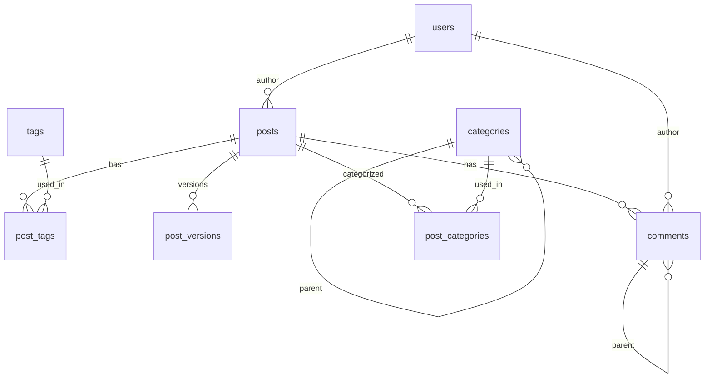

# SQL 操作文档

## 数据库初始化脚本

### 1. 表结构初始化

```sql
-- 1. 删除现有表（如果存在）
DROP TABLE IF EXISTS post_versions CASCADE;
DROP TABLE IF EXISTS post_tags CASCADE;
DROP TABLE IF EXISTS comments CASCADE;
DROP TABLE IF EXISTS posts CASCADE;
DROP TABLE IF EXISTS tags CASCADE;
DROP TABLE IF EXISTS users CASCADE;
DROP TABLE IF EXISTS categories CASCADE;
DROP TABLE IF EXISTS post_categories CASCADE;
DROP TABLE IF EXISTS media CASCADE;
DROP TABLE IF EXISTS settings CASCADE;
DROP TABLE IF EXISTS post_views CASCADE;

-- 2. 创建用户表
CREATE TABLE users (
    id UUID PRIMARY KEY DEFAULT uuid_generate_v4(),
    email VARCHAR(255) UNIQUE NOT NULL,
    name VARCHAR(255) NOT NULL,
    avatar_url TEXT,
    created_at TIMESTAMP WITH TIME ZONE DEFAULT CURRENT_TIMESTAMP,
    updated_at TIMESTAMP WITH TIME ZONE DEFAULT CURRENT_TIMESTAMP,
    deleted_at TIMESTAMP WITH TIME ZONE
);

-- 3. 创建文章表
CREATE TABLE posts (
    id UUID PRIMARY KEY DEFAULT uuid_generate_v4(),
    title VARCHAR(255) NOT NULL,
    slug VARCHAR(255) UNIQUE NOT NULL,
    content TEXT,
    excerpt TEXT,
    status VARCHAR(20) DEFAULT 'draft',
    author_id UUID REFERENCES auth.users(id),
    created_at TIMESTAMP WITH TIME ZONE DEFAULT CURRENT_TIMESTAMP,
    updated_at TIMESTAMP WITH TIME ZONE DEFAULT CURRENT_TIMESTAMP,
    published_at TIMESTAMP WITH TIME ZONE,
    deleted_at TIMESTAMP WITH TIME ZONE
);

-- 4. 创建标签表
CREATE TABLE tags (
    id UUID PRIMARY KEY DEFAULT uuid_generate_v4(),
    name VARCHAR(50) NOT NULL,
    slug VARCHAR(50) UNIQUE NOT NULL,
    created_at TIMESTAMP WITH TIME ZONE DEFAULT CURRENT_TIMESTAMP,
    updated_at TIMESTAMP WITH TIME ZONE DEFAULT CURRENT_TIMESTAMP
);

-- 5. 创建文章标签关联表
CREATE TABLE post_tags (
    id UUID PRIMARY KEY DEFAULT uuid_generate_v4(),
    post_id UUID REFERENCES posts(id) ON DELETE CASCADE,
    tag_id UUID REFERENCES tags(id) ON DELETE CASCADE,
    created_at TIMESTAMP WITH TIME ZONE DEFAULT CURRENT_TIMESTAMP,
    UNIQUE(post_id, tag_id)
);

-- 6. 创建文章版本表
CREATE TABLE post_versions (
    id UUID PRIMARY KEY DEFAULT uuid_generate_v4(),
    post_id UUID REFERENCES posts(id) ON DELETE CASCADE,
    content TEXT NOT NULL,
    metadata JSONB,
    version_type VARCHAR(20) DEFAULT 'auto',
    description TEXT,
    created_at TIMESTAMP WITH TIME ZONE DEFAULT CURRENT_TIMESTAMP
);

-- 7. 创建评论表
CREATE TABLE comments (
    id UUID PRIMARY KEY DEFAULT uuid_generate_v4(),
    post_id UUID REFERENCES posts(id) ON DELETE CASCADE,
    user_id UUID REFERENCES users(id),
    parent_id UUID REFERENCES comments(id),
    content TEXT NOT NULL,
    created_at TIMESTAMP WITH TIME ZONE DEFAULT CURRENT_TIMESTAMP,
    updated_at TIMESTAMP WITH TIME ZONE DEFAULT CURRENT_TIMESTAMP,
    deleted_at TIMESTAMP WITH TIME ZONE
);

-- 分类表
CREATE TABLE categories (
    id UUID PRIMARY KEY DEFAULT uuid_generate_v4(),
    name VARCHAR(50) NOT NULL,
    slug VARCHAR(50) UNIQUE NOT NULL,
    description TEXT,
    parent_id UUID REFERENCES categories(id),
    created_at TIMESTAMP WITH TIME ZONE DEFAULT CURRENT_TIMESTAMP,
    updated_at TIMESTAMP WITH TIME ZONE DEFAULT CURRENT_TIMESTAMP
);

-- 文章分类关联表
CREATE TABLE post_categories (
    post_id UUID NOT NULL,
    category_id UUID NOT NULL,
    PRIMARY KEY (post_id, category_id),
    FOREIGN KEY (post_id) REFERENCES posts(id) ON DELETE CASCADE,
    FOREIGN KEY (category_id) REFERENCES categories(id)
);

-- 媒体资源表
CREATE TABLE media (
    id UUID PRIMARY KEY DEFAULT uuid_generate_v4(),
    filename VARCHAR(255) NOT NULL,
    url TEXT NOT NULL,
    mime_type VARCHAR(100),
    size INTEGER,
    width INTEGER,
    height INTEGER,
    uploaded_by UUID REFERENCES auth.users(id),
    created_at TIMESTAMP WITH TIME ZONE DEFAULT CURRENT_TIMESTAMP
);

-- 系统设置表
CREATE TABLE settings (
    key VARCHAR(255) PRIMARY KEY,
    value JSONB NOT NULL,
    updated_at TIMESTAMP WITH TIME ZONE DEFAULT CURRENT_TIMESTAMP
);

-- 文章访问统计表
CREATE TABLE post_views (
    id UUID PRIMARY KEY DEFAULT uuid_generate_v4(),
    post_id UUID REFERENCES posts(id) ON DELETE CASCADE,
    viewer_ip VARCHAR(45),
    user_agent TEXT,
    referer TEXT,
    created_at TIMESTAMP WITH TIME ZONE DEFAULT CURRENT_TIMESTAMP
);
```

### 2. 索引创建

```sql
-- 创建必要的索引
CREATE INDEX idx_posts_slug ON posts(slug);
CREATE INDEX idx_posts_status ON posts(status);
CREATE INDEX idx_posts_created_at ON posts(created_at);
CREATE INDEX idx_tags_slug ON tags(slug);
CREATE INDEX idx_post_tags_post_id ON post_tags(post_id);
CREATE INDEX idx_post_tags_tag_id ON post_tags(tag_id);
CREATE INDEX idx_comments_post_id ON comments(post_id);
CREATE INDEX idx_post_versions_post_id ON post_versions(post_id);
```

### 3. 触发器设置

```sql
-- 更新时间戳触发器函数
CREATE OR REPLACE FUNCTION update_updated_at()
RETURNS TRIGGER AS $$
BEGIN
    NEW.updated_at = CURRENT_TIMESTAMP;
    RETURN NEW;
END;
$$ LANGUAGE plpgsql;

-- 表触发器
CREATE TRIGGER update_posts_updated_at
    BEFORE UPDATE ON posts
    FOR EACH ROW
    EXECUTE FUNCTION update_updated_at();

CREATE TRIGGER update_comments_updated_at
    BEFORE UPDATE ON comments
    FOR EACH ROW
    EXECUTE FUNCTION update_updated_at();

CREATE TRIGGER update_tags_updated_at
    BEFORE UPDATE ON tags
    FOR EACH ROW
    EXECUTE FUNCTION update_updated_at();
```

### 触发器说明
1. **更新时间戳触发器**
   - 作用：自动更新记录的 updated_at 字段
   - 触发时机：在记录更新之前（BEFORE UPDATE）
   - 影响表：posts, comments, tags
   - 执行级别：行级触发器（FOR EACH ROW）

## 常用查询

### 1. 文章相关查询

```sql
-- 获取文章列表（带标签）
SELECT p.*,
    array_agg(t.name) as tag_names,
    array_agg(t.slug) as tag_slugs
FROM posts p
LEFT JOIN post_tags pt ON p.id = pt.post_id
LEFT JOIN tags t ON pt.tag_id = t.id
WHERE p.deleted_at IS NULL
GROUP BY p.id
ORDER BY p.created_at DESC;

-- 获取单篇文章详情（带标签和评论数）
SELECT p.*,
    json_agg(DISTINCT jsonb_build_object(
        'id', t.id,
        'name', t.name,
        'slug', t.slug
    )) as tags,
    COUNT(DISTINCT c.id) as comment_count
FROM posts p
LEFT JOIN post_tags pt ON p.id = pt.post_id
LEFT JOIN tags t ON pt.tag_id = t.id
LEFT JOIN comments c ON p.id = c.post_id AND c.deleted_at IS NULL
WHERE p.slug = $1 AND p.deleted_at IS NULL
GROUP BY p.id;
```

### 2. 标签相关查询

```sql
-- 获取标签列表（带文章数量）
SELECT t.*,
    COUNT(DISTINCT pt.post_id) as post_count
FROM tags t
LEFT JOIN post_tags pt ON t.id = pt.tag_id
LEFT JOIN posts p ON pt.post_id = p.id AND p.deleted_at IS NULL
GROUP BY t.id
ORDER BY post_count DESC;
```

### 3. 评论相关查询

```sql
-- 获取文章评论（带用户信息）
SELECT c.*,
    json_build_object(
        'id', u.id,
        'name', u.name,
        'avatar_url', u.avatar_url
    ) as user_info
FROM comments c
LEFT JOIN users u ON c.user_id = u.id
WHERE c.post_id = $1 AND c.deleted_at IS NULL
ORDER BY c.created_at ASC;
```

## 维护操作

### 1. 数据库优化

```sql
-- 清理软删除的数据（可选）
DELETE FROM posts WHERE deleted_at < NOW() - INTERVAL '30 days';
DELETE FROM comments WHERE deleted_at < NOW() - INTERVAL '30 days';

-- 更新统计信息
ANALYZE posts;
ANALYZE tags;
ANALYZE comments;
```

### 2. 性能监控

```sql
-- 创建性能监控函数
CREATE OR REPLACE FUNCTION get_database_metrics()
RETURNS json AS $$
DECLARE
    result json;
BEGIN
    SELECT json_build_object(
        'table_sizes', (
            SELECT json_object_agg(tablename, pg_total_relation_size(tablename::text))
            FROM pg_tables
            WHERE schemaname = 'public'
        ),
        'index_sizes', (
            SELECT json_object_agg(indexname, pg_relation_size(indexname::text))
            FROM pg_indexes
            WHERE schemaname = 'public'
        ),
        'slow_queries', (
            SELECT json_agg(query)
            FROM pg_stat_statements
            ORDER BY mean_time DESC
            LIMIT 5
        )
    ) INTO result;
    
    RETURN result;
END;
$$ LANGUAGE plpgsql;
```

## 注意事项

1. 执行删除表操作前请确保已备份数据
2. 创建索引可能会锁表，建议在低峰期执行
3. 定期执行 ANALYZE 以更新统计信息
4. 监控慢查询并适时优化
5. 定期清理软删除的数据

## 备份和恢复

```sql
-- 创建数据库备份函数
CREATE OR REPLACE FUNCTION backup_database()
RETURNS void AS $$
BEGIN
    -- 备份逻辑
END;
$$ LANGUAGE plpgsql;

-- 创建数据库恢复函数
CREATE OR REPLACE FUNCTION restore_database()
RETURNS void AS $$
BEGIN
    -- 恢复逻辑
END;
$$ LANGUAGE plpgsql;
```

## 数据库关系图

### 核心业务表关系


### 系统表关系

1. **认证相关 (auth schema)**
- users -> sessions (1:many)
- users -> identities (1:many)
- users -> mfa_factors (1:many)
- users -> one_time_tokens (1:many)
- sessions -> refresh_tokens (1:many)
- sessions -> mfa_amr_claims (1:many)
- sso_providers -> saml_providers (1:many)
- sso_providers -> sso_domains (1:many)
- sso_providers -> saml_relay_states (1:many)
- mfa_factors -> mfa_challenges (1:many)

2. **存储相关 (storage schema)**
- buckets -> objects (1:many)
- buckets -> s3_multipart_uploads (1:many)
- buckets -> s3_multipart_uploads_parts (1:many)
- s3_multipart_uploads -> s3_multipart_uploads_parts (1:many)

## 外键约束

```sql
-- 核心业务表约束
ALTER TABLE categories
    ADD CONSTRAINT categories_parent_id_fkey 
    FOREIGN KEY (parent_id) REFERENCES categories(id);

ALTER TABLE post_categories
    ADD CONSTRAINT post_categories_category_id_fkey 
    FOREIGN KEY (category_id) REFERENCES categories(id);

-- 认证相关约束
ALTER TABLE sessions
    ADD CONSTRAINT sessions_user_id_fkey 
    FOREIGN KEY (user_id) REFERENCES auth.users(id);

ALTER TABLE identities
    ADD CONSTRAINT identities_user_id_fkey 
    FOREIGN KEY (user_id) REFERENCES auth.users(id);

-- 存储相关约束
ALTER TABLE objects
    ADD CONSTRAINT objects_bucketId_fkey 
    FOREIGN KEY (bucket_id) REFERENCES storage.buckets(id);
```

## 注意事项

1. **Schema 分离**
- public: 核心业务表
- auth: 认证相关表
- storage: 文件存储相关表

2. **级联删除**
- post_categories: 文章或分类删除时级联删除
- post_tags: 文章或标签删除时级联删除
- comments: 文章删除时级联删除

3. **自引用关系**
- categories: 支持层级分类结构
- comments: 支持评论回复功能 
```

### 文章版本和评论表结构

```sql
-- 文章版本表
CREATE TABLE post_versions (
    id UUID PRIMARY KEY DEFAULT uuid_generate_v4(),
    post_id UUID REFERENCES posts(id) ON DELETE CASCADE,
    content TEXT NOT NULL,
    metadata JSONB,
    version_type VARCHAR(20) DEFAULT 'auto',
    description TEXT,
    created_at TIMESTAMP WITH TIME ZONE DEFAULT CURRENT_TIMESTAMP
);

-- 评论表
CREATE TABLE comments (
    id UUID PRIMARY KEY DEFAULT uuid_generate_v4(),
    post_id UUID REFERENCES posts(id) ON DELETE CASCADE,
    user_id UUID REFERENCES users(id),
    parent_id UUID REFERENCES comments(id),
    content TEXT NOT NULL,
    created_at TIMESTAMP WITH TIME ZONE DEFAULT CURRENT_TIMESTAMP,
    updated_at TIMESTAMP WITH TIME ZONE DEFAULT CURRENT_TIMESTAMP,
    deleted_at TIMESTAMP WITH TIME ZONE
);

-- 索引
CREATE INDEX idx_post_versions_post_id ON post_versions(post_id);
CREATE INDEX idx_comments_post_id ON comments(post_id);
CREATE INDEX idx_comments_user_id ON comments(user_id);
CREATE INDEX idx_comments_parent_id ON comments(parent_id);
```

### 约束说明

1. **post_versions 表约束**
   - 主键约束：id (UUID)
   - 外键约束：post_id 引用 posts(id)，级联删除
   - NOT NULL：content

2. **comments 表约束**
   - 主键约束：id (UUID)
   - 外键约束：
     - post_id 引用 posts(id)，级联删除
     - user_id 引用 users(id)
     - parent_id 引用 comments(id)（自引用，支持嵌套评论）
   - NOT NULL：content

### 索引优化
- post_versions.post_id：优化文章版本查询
- comments.post_id：优化文章评论查询
- comments.user_id：优化用户评论查询
- comments.parent_id：优化嵌套评论查询

### 特殊功能
1. **版本控制**
   - post_versions 表支持文章内容的版本控制
   - 通过 version_type 区分自动保存和手动保存
   - metadata 字段存储版本相关的元数据

2. **评论系统**
   - 支持嵌套评论（通过 parent_id 自引用）
   - 支持软删除（通过 deleted_at）
   - 记录评论的创建和更新时间 
```

### 辅助表结构

```sql
-- 媒体表
CREATE TABLE media (
    id UUID PRIMARY KEY DEFAULT uuid_generate_v4(),
    filename VARCHAR(255) NOT NULL,
    url TEXT NOT NULL,
    mime_type VARCHAR(100),
    size INTEGER,
    width INTEGER,
    height INTEGER,
    uploaded_by UUID REFERENCES auth.users(id),
    created_at TIMESTAMP WITH TIME ZONE DEFAULT CURRENT_TIMESTAMP
);

-- 系统设置表
CREATE TABLE settings (
    key VARCHAR(255) PRIMARY KEY,
    value JSONB NOT NULL,
    updated_at TIMESTAMP WITH TIME ZONE DEFAULT CURRENT_TIMESTAMP
);

-- 文章访问统计表
CREATE TABLE post_views (
    id UUID PRIMARY KEY DEFAULT uuid_generate_v4(),
    post_id UUID REFERENCES posts(id) ON DELETE CASCADE,
    viewer_ip VARCHAR(45),
    user_agent TEXT,
    referer TEXT,
    created_at TIMESTAMP WITH TIME ZONE DEFAULT CURRENT_TIMESTAMP
);

-- 索引
CREATE INDEX idx_media_uploaded_by ON media(uploaded_by);
CREATE INDEX idx_post_views_post_id ON post_views(post_id);
CREATE INDEX idx_post_views_created_at ON post_views(created_at);
```

### 表结构说明

1. **media 表**
   - 主要用于存储上传的媒体文件信息
   - 包含文件尺寸信息（width, height）
   - 记录文件大小和类型
   - 追踪上传者信息

2. **settings 表**
   - 使用 key-value 结构存储系统设置
   - value 使用 JSONB 类型支持复杂配置
   - 记录配置更新时间

3. **post_views 表**
   - 记录文章访问统计
   - 存储访问者IP和用户代理信息
   - 包含来源页面信息
   - 支持访问时间分析

### 主要变更说明
1. media 表结构更简化，移除了 metadata 字段，添加了具体的媒体属性
2. settings 表使用更简单的结构，移除了 description 字段
3. post_views 表添加了 referer 字段，移除了 viewer_id 字段

### 使用建议
1. media 表的 url 字段应存储完整的访问路径
2. settings 表的 value 字段可存储任意 JSON 结构
3. post_views 表应考虑定期归档以提高性能 
```

### 性能监控系统

#### 1. 基础统计表
```sql
CREATE TABLE daily_stats (
    id UUID PRIMARY KEY DEFAULT uuid_generate_v4(),
    collected_at TIMESTAMP WITH TIME ZONE DEFAULT CURRENT_TIMESTAMP,
    posts_count INTEGER,
    comments_count INTEGER,
    total_views INTEGER,
    active_users INTEGER,
    avg_response_time NUMERIC
);

CREATE INDEX idx_daily_stats_collected_at ON daily_stats(collected_at);
```

#### 2. 统计函数
```sql
-- 基础统计收集函数
CREATE OR REPLACE FUNCTION collect_daily_stats()
RETURNS void AS $$
BEGIN
    INSERT INTO daily_stats (
        posts_count,
        comments_count,
        total_views,
        active_users,
        avg_response_time
    )
    SELECT
        (SELECT count(*) FROM posts),
        (SELECT count(*) FROM comments),
        (SELECT count(*) FROM post_views WHERE created_at > CURRENT_DATE),
        (SELECT count(DISTINCT user_id) FROM comments WHERE created_at > CURRENT_DATE),
        (SELECT coalesce(avg(extract(epoch from current_timestamp - created_at)), 0)
         FROM post_views WHERE created_at > CURRENT_DATE);
END;
$$ LANGUAGE plpgsql;

-- 增长统计函数
CREATE OR REPLACE FUNCTION get_growth_stats()
RETURNS TABLE (
    metric_name TEXT,
    current_value INTEGER,
    growth_rate NUMERIC,
    trend TEXT
) AS $$
BEGIN
    RETURN QUERY
    WITH current_stats AS (
        SELECT * FROM daily_stats
        WHERE collected_at::DATE = CURRENT_DATE
        ORDER BY collected_at DESC
        LIMIT 1
    ),
    prev_stats AS (
        SELECT * FROM daily_stats
        WHERE collected_at::DATE = CURRENT_DATE - INTERVAL '7 days'
        ORDER BY collected_at DESC
        LIMIT 1
    )
    SELECT
        m.metric_name,
        m.current_val,
        ROUND(((m.current_val - m.prev_val)::NUMERIC / NULLIF(m.prev_val, 0) * 100), 2) as growth,
        CASE 
            WHEN m.current_val > m.prev_val THEN '↑'
            WHEN m.current_val < m.prev_val THEN '↓'
            ELSE '→'
        END
    FROM (
        SELECT 
            'Posts' as metric_name,
            COALESCE(c.posts_count, 0) as current_val,
            COALESCE(p.posts_count, 0) as prev_val
        FROM current_stats c
        FULL OUTER JOIN prev_stats p ON true
        UNION ALL
        SELECT 
            'Comments',
            COALESCE(c.comments_count, 0),
            COALESCE(p.comments_count, 0)
        FROM current_stats c
        FULL OUTER JOIN prev_stats p ON true
        UNION ALL
        SELECT 
            'Active Users',
            COALESCE(c.active_users, 0),
            COALESCE(p.active_users, 0)
        FROM current_stats c
        FULL OUTER JOIN prev_stats p ON true
    ) m;
END;
$$ LANGUAGE plpgsql;
```

#### 3. 定时任务设置
```sql
-- 设置每天凌晨 1 点收集统计数据
SELECT cron.schedule('daily_stats_collection', '0 1 * * *', 'SELECT collect_daily_stats()');

-- 设置每周一清理90天前的数据
SELECT cron.schedule('cleanup_old_stats', '0 0 * * 1', 
    'DELETE FROM daily_stats WHERE collected_at < CURRENT_DATE - INTERVAL ''90 days''');
```

### 监控指标说明

1. **增长统计 (get_growth_stats)**
   - metric_name: 监控指标名称（Posts/Comments/Active Users）
   - current_value: 当前值
   - growth_rate: 与7天前相比的增长率（百分比）
   - trend: 趋势指示符（↑ 增长，↓ 下降，→ 持平）

2. **详细统计 (get_detailed_stats)**
   - metric_name: 监控指标名称
   - daily_value: 当日数值
   - week_avg: 7天平均值
   - month_avg: 30天平均值
   - trend_indicator: 与周平均的比较

### 使用示例
```sql
-- 查看增长统计
SELECT * FROM get_growth_stats();

-- 查看详细统计
SELECT * FROM get_detailed_stats();

-- 手动收集统计数据
SELECT collect_daily_stats();
```

### 维护建议
1. 定期验证统计数据的准确性
2. 监控定时任务的执行情况
3. 检查数据收集的完整性
4. 根据需要调整数据保留期限（当前90天） 