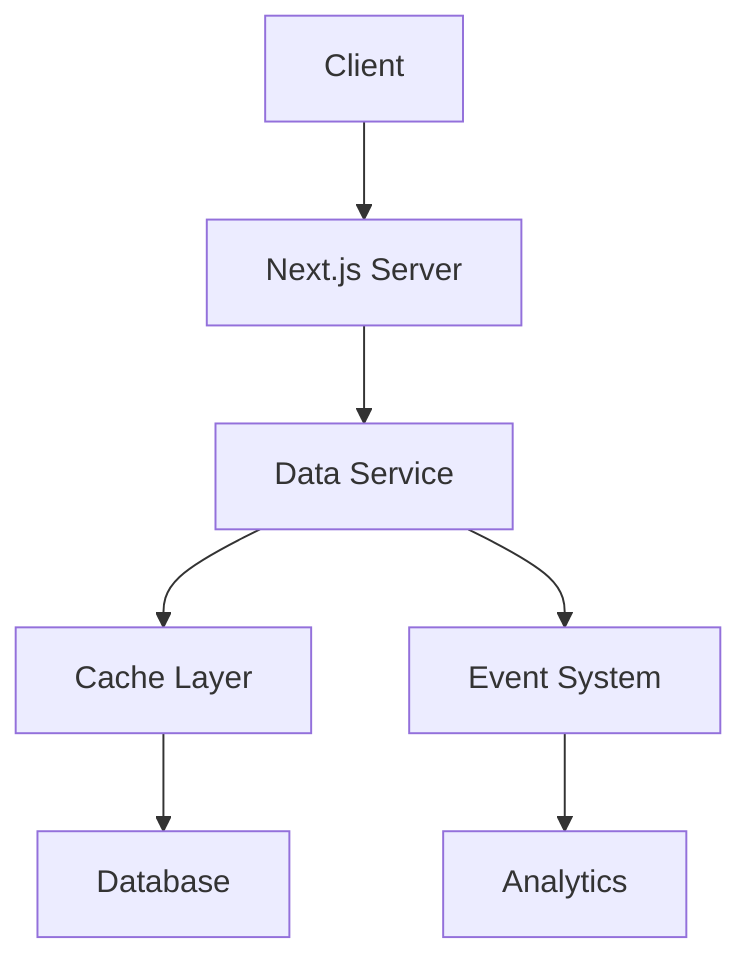

# 项目进展文档

## 1. 系统分析

### 1.1 核心组件分析

#### 1.1.1 文章渲染系统
```typescript:src/components/blog/ArticleContent.tsx
// 当前实现
export default function ArticleContent({ source }: ArticleContentProps) {
  return (
    <article className="prose dark:prose-invert max-w-none">
      <MDXRemote {...source} components={CustomComponents} />
    </article>
  )
}
```

**优点：**
- MDX 支持完善
- 自定义组件系统灵活
- 样式系统统一

**待改进：**
- 缺少错误边界处理
- 性能优化空间（如代码分割）
- 缺少加载状态处理

#### 1.1.2 数据服务层
```typescript
// 基础服务层架构
interface BaseService {
  create: <T>(data: T) => Promise<T>;
  update: <T>(id: string, data: Partial<T>) => Promise<T>;
  delete: (id: string) => Promise<void>;
  findById: <T>(id: string) => Promise<T>;
  findAll: <T>(query?: QueryOptions) => Promise<T[]>;
}
```

**优点：**
- 统一的 CRUD 接口
- 类型安全
- 错误处理机制

**待改进：**
- 缓存策略优化
- 批量操作支持
- 事务处理机制

### 1.2 技术栈分析

#### 1.2.1 前端技术栈
- Next.js (App Router)
- React 18
- TypeScript
- Tailwind CSS
- MDX
- React Query

**优势：**
- 现代化技术栈
- 良好的 TypeScript 支持
- 强大的样式解决方案

**挑战：**
- 需要优化构建配置
- SSR 性能优化空间
- 状态管理策略待完善

#### 1.2.2 后端技术栈
- Node.js
- PostgreSQL
- Prisma
- Redis (缓存层)

**优势：**
- 类型安全的 ORM
- 可靠的数据库选择
- 灵活的缓存方案

**挑战：**
- 数据库查询优化
- 缓存策略完善
- API 性能提升

### 1.3 数据流分析

#### 1.3.1 文章数据流


**关键点：**
- 数据获取路径优化
- 缓存更新策略
- 实时性要求

#### 1.3.2 用户交互流
```typescript
interface InteractionFlow {
  view: {
    tracking: boolean;
    metrics: ViewMetrics;
    cache: CacheStrategy;
  };
  engagement: {
    likes: boolean;
    comments: boolean;
    shares: boolean;
  };
  analytics: {
    realtime: boolean;
    batch: boolean;
    retention: number;
  };
}
```

### 1.4 性能分析

#### 1.4.1 当前性能指标
- 首屏加载时间：~2.5s
- API 响应时间：~300ms
- TTFB：~100ms
- FCP：~1.2s
- LCP：~2.8s

#### 1.4.2 性能瓶颈
1. 数据库查询优化空间
2. 缓存利用率不足
3. 客户端资源加载优化
4. SSR 性能提升空间

### 1.5 安全性分析

#### 1.5.1 现有安全措施
- CSRF 保护
- XSS 防护
- SQL 注入防护
- 请求速率限制

#### 1.5.2 待加强项
- 权限系统细化
- 审计日志完善
- 敏感数据处理
- API 安全性提升

### 1.6 可维护性分析

#### 1.6.1 代码质量
```typescript
// 典型的代码模式
interface ServicePattern {
  // 统一的错误处理
  errorHandling: {
    type: 'global' | 'local';
    strategy: ErrorStrategy;
  };
  
  // 日志记录
  logging: {
    level: LogLevel;
    retention: number;
  };
  
  // 性能监控
  monitoring: {
    metrics: string[];
    interval: number;
  };
}
```

#### 1.6.2 文档状况
- API 文档完整度：80%
- 组件文档完整度：60%
- 架构文档完整度：40%

### 1.7 扩展性分析

#### 1.7.1 现有扩展点
- 插件系统
- 中间件机制
- 自定义钩子
- 事件系统

#### 1.7.2 待优化项
- 模块化改进
- API 版本控制
- 服务解耦
- 配置中心

## 2. 改进计划

### 2.1 近期优化（Sprint 1: 2周）

#### 2.1.1 错误处理系统优化
```typescript:src/lib/error/index.ts
// 计划实现的错误处理系统
interface ErrorHandlingSystem {
  // 全局错误边界
  ErrorBoundary: React.ComponentType<{
    fallback: React.ReactNode;
    onError?: (error: Error) => void;
  }>;
  
  // 错误上报服务
  errorReporting: {
    captureError: (error: Error) => void;
    captureMessage: (message: string) => void;
    breadcrumbs: string[];
  };
  
  // 错误恢复机制
  recovery: {
    retry: (operation: () => Promise<any>) => Promise<any>;
    fallback: (error: Error) => React.ReactNode;
  };
}
```

**实施步骤：**
- [ ] 实现全局错误边界组件
- [ ] 添加错误上报服务
- [ ] 完善错误恢复机制
- [ ] 集成错误监控系统

#### 2.1.2 性能监控体系
```typescript:src/lib/monitoring/index.ts
// 性能监控系统
interface PerformanceMonitoring {
  // 性能指标收集
  metrics: {
    collectWebVitals: () => void;
    collectApiMetrics: () => void;
    collectResourceMetrics: () => void;
  };
  
  // 性能分析
  analysis: {
    generateReport: () => PerformanceReport;
    detectBottlenecks: () => PerformanceBottleneck[];
  };
  
  // 告警系统
  alerts: {
    thresholds: Record<string, number>;
    notify: (metric: string, value: number) => void;
  };
}
```

**实施步骤：**
- [ ] 实现性能指标收集
- [ ] 建立性能分析系统
- [ ] 配置告警阈值
- [ ] 集成监控面板

### 2.2 中期优化（Sprint 2-3: 1个月）

#### 2.2.1 缓存系统优化
```typescript:src/lib/cache/index.ts
// 多级缓存系统
interface CacheSystem {
  // 内存缓存
  memory: {
    set: (key: string, value: any, ttl?: number) => void;
    get: (key: string) => any;
    invalidate: (pattern: string) => void;
  };
  
  // Redis缓存
  redis: {
    set: (key: string, value: any, ttl?: number) => Promise<void>;
    get: (key: string) => Promise<any>;
    invalidate: (pattern: string) => Promise<void>;
  };
  
  // 缓存策略
  strategy: {
    writeThrough: boolean;
    readThrough: boolean;
    writeBack: boolean;
    ttl: number;
  };
}
```

**实施步骤：**
- [ ] 实现多级缓存
- [ ] 优化缓存策略
- [ ] 添加缓存预热
- [ ] 实现缓存监控

#### 2.2.2 数据库优化
```typescript:src/lib/database/index.ts
// 数据库优化系统
interface DatabaseOptimization {
  // 查询优化
  query: {
    analyze: (sql: string) => QueryPlan;
    optimize: (sql: string) => string;
    cache: (sql: string) => void;
  };
  
  // 索引管理
  index: {
    analyze: () => IndexUsage[];
    suggest: () => IndexSuggestion[];
    create: (suggestion: IndexSuggestion) => Promise<void>;
  };
  
  // 性能监控
  monitoring: {
    slowQueries: () => SlowQuery[];
    deadlocks: () => Deadlock[];
    connections: () => ConnectionStats;
  };
}
```

**实施步骤：**
- [ ] 实现查询分析
- [ ] 优化索引策略
- [ ] 配置性能监控
- [ ] 实现自动优化

### 2.3 长期优化（Sprint 4-6: 3个月）

#### 2.3.1 微服务架构转型
```typescript:src/services/index.ts
// 微服务架构
interface MicroserviceArchitecture {
  // 服务注册
  registry: {
    register: (service: Service) => void;
    discover: (serviceName: string) => ServiceInstance[];
  };
  
  // 负载均衡
  loadBalancer: {
    strategy: 'round-robin' | 'least-connections' | 'random';
    select: (instances: ServiceInstance[]) => ServiceInstance;
  };
  
  // 服务通信
  communication: {
    rpc: (service: string, method: string, data: any) => Promise<any>;
    eventBus: EventBusInterface;
  };
}
```

**实施步骤：**
- [ ] 服务拆分规划
- [ ] 实现服务注册
- [ ] 配置负载均衡
- [ ] 建立服务通信

#### 2.3.2 监控系统完善
```typescript:src/monitoring/index.ts
// 完整监控系统
interface MonitoringSystem {
  // 应用监控
  apm: {
    tracing: TracingSystem;
    metrics: MetricsSystem;
    logging: LoggingSystem;
  };
  
  // 基础设施监控
  infrastructure: {
    servers: ServerMonitoring;
    databases: DatabaseMonitoring;
    caches: CacheMonitoring;
  };
  
  // 业务监控
  business: {
    kpis: KPIMonitoring;
    alerts: AlertSystem;
    reports: ReportingSystem;
  };
}
```

**实施步骤：**
- [ ] 实现全链路追踪
- [ ] 配置基础设施监控
- [ ] 建立业务监控
- [ ] 完善报警系统

## 3. 进度追踪

### 3.1 当前进度
- 系统分析：100%
- 近期优化：0%
- 中期优化：0%
- 长期优化：0%

### 3.2 下一步计划
1. 开始错误处理系统实现
2. 准备性能监控体系搭建
3. 规划缓存系统优化
4. 设计数据库优化方案
```